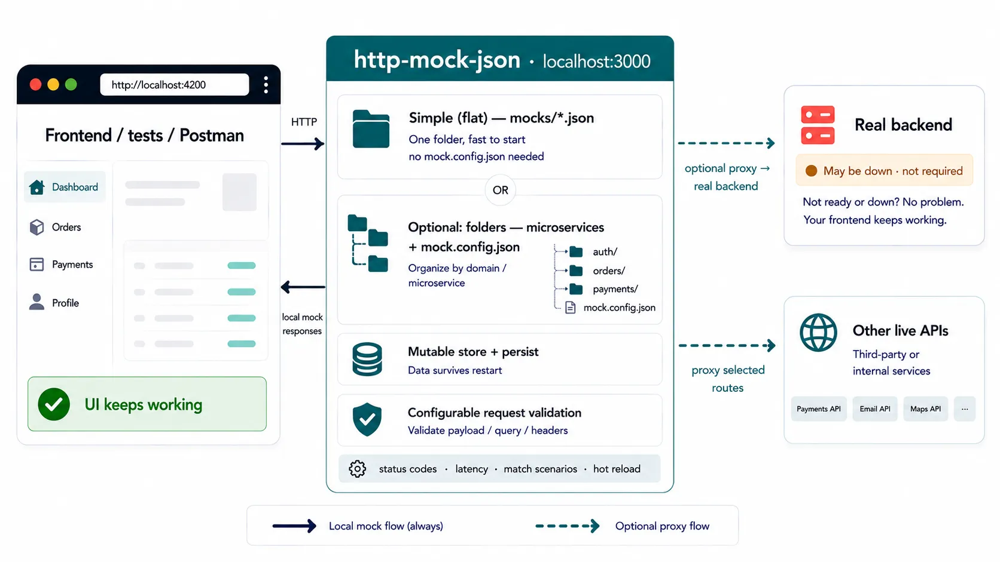

<p align="center">
  
</p>

[](https://www.npmjs.com/package/http-mock-json)
[](https://www.npmjs.com/package/http-mock-json)
[](LICENSE)
[](https://github.com/alejandrorodrom/http-mock-json/stargazers)
[](https://github.com/alejandrorodrom/http-mock-json/actions/workflows/ci.yml)
[](https://github.com/alejandrorodrom/http-mock-json/actions/workflows/e2e.yml)
[](https://github.com/alejandrorodrom/http-mock-json/actions/workflows/npm-audit.yml)


> Mock your real API in JSON — status codes, errors, validation, latency, and mutable data — so the frontend can develop and test without waiting on a backend.

Define the same endpoints your app will call. Switch success and failure scenarios, validate request shapes, persist collections, proxy selected routes to a live server — or **record staging once** and replay from `.recordings/` with no backend online.

<p align="center">
  
</p>

The frontend keeps calling HTTP on your machine. Backend outages stop blocking you. Use flat `mocks/*.json` or microservice folders; proxy only the routes that should still hit a live service, or capture them with [Record & Replay](#record--replay) and keep working offline.

## Why http-mock-json

- **JSON-first** — describe routes and responses in plain files; no code required to mock an API
- **Frontend-ready** — status codes, headers, delays, multipart/raw bodies, and mutable CRUD stores
- **Safe by default** — startup validation catches broken mocks before they waste your time
- **Watch mode** — server restarts when mock files change
- **Opt-in depth** — start static; add `match`, `request`, `store`, or `proxy` only when you need them
- **Record & Replay** — point `--proxy` at staging, hit the app once with `--record`, then replay those fixtures locally without the upstream

## Quick Start

Requires **Node.js >= 22.12**.

```bash
npm install http-mock-json --save-dev
npx mock-server init
npx mock-server start
```

Server defaults to `http://localhost:3000`. After `init`, `npm run mock:start` uses **`-p 3001`** (port). Full walkthrough: [Getting started](#getting-started).

Prefer bootstrapping from a real API instead of hand-writing every mock?

```bash
npx mock-server start --proxy https://api.staging.com --record
# exercise the app… then Ctrl+C
npx mock-server start   # loads mocks + .recordings/ by default
```

Details: [Record & Replay](#record--replay).

## Demo — switch responses from JSON

This package is a **CLI** that boots a local HTTP server from JSON mock files (not an embeddable SDK). Your app calls `http://localhost:3000/...` the same way it would call staging.

Minimal mock (simplified vs the fuller fixture [`mocks/01-basic-multiple-responses.json`](mocks/01-basic-multiple-responses.json)):

```json
{
  "data/animals": {
    "GET": {
      "nameResponse": "success",
      "responses": [
        {
          "name": "success",
          "statusCode": "200",
          "body": { "items": [{ "id": 1, "name": "Fox" }] }
        },
        {
          "name": "error",
          "statusCode": "500",
          "body": { "message": "Upstream failed" }
        }
      ]
    }
  }
}
```

```bash
npx mock-server start
curl -i http://localhost:3000/data/animals
```

```http
HTTP/1.1 200 OK
Content-Type: application/json; charset=utf-8

{"items":[{"id":1,"name":"Fox"}]}
```

Change `"nameResponse"` to `"error"` (watch mode reloads). The same URL now returns the failure your UI must handle:

```http
HTTP/1.1 500 Internal Server Error
Content-Type: application/json; charset=utf-8

{"message":"Upstream failed"}
```

Same URL, different backend behavior — controlled from JSON.

## Documentation

This README is the full guide and reference. Quick help: [FAQ](docs/faq.md) · [Troubleshooting](docs/troubleshooting.md) · [Changelog](CHANGELOG.md).

Day-one path: [Getting started](#getting-started) · [Concepts](#concepts) · [Examples](docs/examples.md). Lookup: [CLI](#cli-reference) · [Record & Replay](#record--replay) · [Store](#store-reference).

## Contents

**Learn** (day-one path — skip Reference until you need it):

- [Getting started](#getting-started)
- [Concepts](#concepts) (includes a short glossary)
- [Examples](docs/examples.md)
- [Advanced examples](docs/advanced-examples.md)
- [Record & Replay](#record--replay) — capture staging, replay offline

**Reference** (lookup when needed):

- [CLI reference](#cli-reference)
- [Mock file reference](#mock-file-reference)
- [Validation reference](#validation-reference)
- [Body compatibility](#body-compatibility)
- [Mock config reference](#mock-config-reference)
- [Store reference](#store-reference)

**Recipes** (product-style; after you know the basics):

- [Store recipes](docs/store-recipes.md) — store-backed app walkthroughs (Examples C–R)
- [Real-world](docs/real-world.md) — multi-feature / multipart / folders / hybrid proxy

## Getting started

### Goal

Install `http-mock-json`, create a mocks directory, add a first mock, and run the server with watch mode so you can edit JSON and see changes reload.

### Prerequisites

- Node.js 22.12 or newer
- A Node project with a `package.json` (recommended so `init` can add a start script)

### Steps

#### 1. Install

```bash
npm install http-mock-json --save-dev
```

The CLI binary is `mock-server`.

#### 2. Initialize

```bash
npx mock-server init
```

By default this will:

1. Create a mocks directory (default name: `mocks`)
2. Add a `mock:start` script to `package.json` (`mock-server start -p 3001`)
3. Prompt you to create a first mock file

`--path` is the **mocks directory itself** (not a parent folder). Flag details live in the [CLI reference](#cli-reference).

#### 3. Answer the first-mock prompts

If mock creation is enabled (default), you will be asked:

1. **JSON file name** — e.g. `animals` → `mocks/animals.json`
2. **Endpoint** — e.g. `data/animals` (route params like `data/animals/:id` are allowed)
3. **HTTP methods** — select one or more of `GET`, `POST`, `PUT`, `PATCH`, `DELETE`
4. **Confirm**

The scaffold sets `nameResponse` to `"success"` and includes two empty responses: `success` (`200`) and `error` (`404`).

You can add more mocks later with `mock-server add` (or `mock-server add --crud` for a store-backed collection). See [CLI](#cli-reference).

#### 4. Fill in response bodies

Open the generated file and put real data in each `body`. A minimal shape looks like this:

```json
{
  "data/animals": {
    "GET": {
      "nameResponse": "success",
      "responses": [
        {
          "name": "success",
          "statusCode": "200",
          "body": {
            "animals": [
              { "id": 1, "name": "Lion" },
              { "id": 2, "name": "Tiger" }
            ]
          }
        },
        {
          "name": "error",
          "statusCode": "404",
          "body": {
            "message": "No animals found"
          }
        }
      ]
    }
  }
}
```

**Abbreviated shape (what you need day one):**

| Piece | Role |
|-------|------|
| Top-level key | Endpoint path (`data/animals`, `users/:id`, …) |
| Uppercase method | `GET` / `POST` / `PUT` / `PATCH` / `DELETE` |
| `nameResponse` | Default response `name` when no `match` applies |
| `responses[]` | Named scenarios; each needs `name`, and usually `statusCode` + `body` |

Optional fields (`match`, `request`, `store`, `proxy`, `delay`, `action`, `encoding`, …) are covered in [Concepts](#concepts) and the [mock file reference](#mock-file-reference).

**Tip:** Change `"nameResponse": "error"` to serve the error scenario by default without touching `match`.

#### 5. Start the server

```bash
npx mock-server start
```

Or, if `init` added the script:

```bash
npm run mock:start
```

Port resolution: `--port` → `mock.config.json` `port` → **`3000`**. The `mock:start` script from `init` uses `-p 3001`.

On start, the server checks port availability, then validates every mock file. Errors block startup; warnings (for example non-standard status codes) do not.

**Watch mode is always on** for `start`: saving a mock file reloads the server. If a reload introduces validation errors, the restart is aborted, the problems are printed, and the previous process stops serving. Fix the mocks, then run `mock-server start` again.

### Expected result

- A mocks directory with at least one `.json` file
- Server listening (e.g. `http://localhost:3000` or `3001` with the generated script)
- Requests to your endpoint return the `nameResponse` body (or a `match`ed response once you add rules)
- Edits to mock JSON trigger an automatic restart (failed validation aborts the restart — see watch note above)

### Recommendations

- Copy a ready-made sample from [Examples](docs/examples.md) when you need more than the scaffold.
- Keep one endpoint’s methods together in the same file; split by domain across multiple JSON files as the API grows.
- Use `request` for input shape checks, and store uniqueness / conflict responses for business `409`s — see [Concepts](#concepts).
- For microservice-style layouts, use folder organization with `mock.config.json` (details in [Mock config](#mock-config-reference)).
- Prefer fixing validation errors before relying on watch reloads; a failed restart leaves the server down until you fix the mocks and start again.

### Next steps

1. [Concepts](#concepts) — how `nameResponse`, `match`, `request`, `store`, and `proxy` fit together at runtime  
2. [Examples](docs/examples.md) — copyable mocks from this repository  
3. [Advanced examples](docs/advanced-examples.md) — one-feature walkthroughs (`match`, delay, request validation, …)  

Lookup in this manual when needed: [CLI](#cli-reference), [Mock file](#mock-file-reference), [Store](#store-reference).

## Concepts

### Goal

Understand the main ideas behind an `http-mock-json` mock — enough to choose the right feature — without memorizing every field.

### Prerequisites

- You can start the server from [Getting started](#getting-started)
- You have at least one mock JSON file under your mocks directory

### Core ideas

#### Named responses and `nameResponse`

Each HTTP method on an endpoint holds a `responses` array. Every entry has a unique `name`.

`nameResponse` is the **fallback**: when no response’s `match` applies, the server returns the response whose `name` equals `nameResponse`.

Use this to flip success vs error (or any scenario) by editing one string. Field rules: [mock file reference](#mock-file-reference).

#### `match` — pick a scenario from the request

Optional `match` on a response selects that scenario when the incoming request fits. Rules can use:

- `params` — route params (`/users/:id`)
- `query` — query string
- `body` — parsed JSON or urlencoded fields
- `headers` — header names (case-insensitive)
- `multipart` — multipart fields / file metadata
- `call` — N-th hit (1-based), with optional scope, `loop`, and `reset`

Matching is **partial**: only the keys you list must agree. **First matching response in array order wins**; if none match, `nameResponse` is used.

Empty `match` objects do not match. Details and examples: [mock file](#mock-file-reference), samples in [Examples](docs/examples.md).

#### `request` — validate before selecting a happy path

Optional method-level `request` checks the inbound payload, query, and/or headers **before** normal `match` / `nameResponse` selection.

Important naming (v4+):

- Use `request.payload` (not `request.body`)
- Grouped error options live under `request.error` (`response`, `format`, `detail`, `key`)

You can set `as` (`json` | `form` | `multipart` | `raw` | `text`) to require a content mode, or omit it and let Content-Type decide. Failed checks select the configured error response instead of running the usual match pipeline.

Depth: [body compatibility](#body-compatibility), [validation](#validation-reference), [mock file](#mock-file-reference).

#### `store` — mutable collections

Opt-in per endpoint: declare a collection with `store` (or reference a shared `store.id` defined elsewhere). Responses can use `action` (`list`, `get`, `create`, `update`, `patch`, `delete`, `restore`) instead of a fixed `body`.

Typical capabilities (see [Store reference](#store-reference)): seed data, persistence, list filters/pagination, soft delete, relations, unique / key conflicts.

`action` cannot share a response with `proxy` or response `encoding`.

#### `proxy` — forward to a real backend

Proxy can appear at several layers:

- Response: `"proxy": true`, a URL string, or `{ "target", "path?" }`
- Method default target for `"proxy": true`
- CLI `--proxy` and folder `mock.config.json` targets for `"proxy": true` and unmatched routes

When a selected response has `proxy` set, the original request is forwarded and the mock `body` / `action` path is skipped. Unmatched routes can still be forwarded if you configured global or folder unmatched proxy mounts. Upstream redirects are not followed (`redirect: "manual"`); the mock returns the 3xx response as-is.

See [mock file](#mock-file-reference) and [CLI](#cli-reference).

#### Record & Replay — capture staging, work offline

Hand-writing every fixture is optional. With `--proxy` and `--record`, proxied responses are written under `.recordings/` (same mock JSON shape). Stop the server, start again without `--record`: recordings load by default next to your mocks, so the frontend keeps the same URLs with no upstream.

Typical loop: record against staging → commit or share sanitized fixtures → day-to-day `mock-server start` (or `--recordings-only`). Full flags and behavior: [CLI — Record & Replay](#record--replay).

### Runtime pipeline (matching order)

For a request that hits a registered mock route, roughly:

1. **Parse** the body when needed (including multipart). Parse failures can become a `request` error response if `request` is configured; otherwise they return a client error.
2. **`request` validation** — if configured and issues are found, serve the request-error response and stop.
3. **Response selection** — walk `responses` in order; first entry with a satisfied `match` wins; otherwise use `nameResponse`.
4. **Delay** — method-level and/or response-level latency.
5. **Fulfill**:
   - `proxy` → forward to the resolved target  
   - `action` + store → run the store operation (conflicts / not-found use named responses when configured)  
   - otherwise → send the mock `body` (or encoded file / base64 body)

After registered routes, unmatched traffic may still hit folder `proxyUnmatched` mounts, then the global `--proxy` catch-all.

Startup checks (port, mock shape, references) are separate from this per-request path — see [validation](#validation-reference).

CORS is enabled by default (browser frontends can call the mock server without a separate CORS mock).

### Glossary

| Term | Meaning |
|------|---------|
| **mocks directory** | Folder passed to `--path` / `-f` (default `mocks`). Contains mock JSON files and optional `mock.config.json`. |
| **mock file** | A `.json` file loaded by `start` (not `mock.config.json`). Top-level keys are **endpoints**. |
| **fixture** | Sample mock under this repo’s [`mocks/`](mocks/) (for copy/paste). |
| **endpoint** | Top-level key in a mock file (e.g. `"data/animals"`). In prose, “route” means the HTTP path, not a JSON field name. |
| **named response** | An entry in `responses[]` with a `name`. Prefer this over “scenario” when talking about the API. |
| **`nameResponse`** | Fallback named response when no `match` applies. |
| **`match`** | Optional object on a response that selects it from the request (`params` / `query` / `body` / …). |
| **`request`** | Method-level validation (`payload` / `query` / `headers`) before response selection. Distinct from **startup validation**. |
| **store definition / reference** | Full `store` object vs `{ "id": "…" }` reuse. Prefer these over bare “schema”. |
| **recording** | Fixture under `.recordings/` written by `--record` while proxying; loaded on `start` unless `--exclude-recordings`. |

### Expected result

You can explain, for a given mock, which response will run: validation error, a `match`ed scenario, the `nameResponse` fallback, a store action, a proxy forward, or a loaded recording.

### Next steps

1. [Examples](docs/examples.md) — copy-paste samples from this repository  
2. [Advanced examples](docs/advanced-examples.md) — one-feature walkthroughs  

Lookup in this manual when needed:

| Need | Section |
|------|---------|
| Every mock field | [Mock file reference](#mock-file-reference) |
| CRUD / persist / list / relations | [Store](#store-reference) |
| Payload modes, files, response encoding | [Body compatibility](#body-compatibility) |
| Folder layouts (`mock.config.json`) | [Mock config](#mock-config-reference) |
| What fails at startup vs at runtime | [Validation](#validation-reference) |
| CLI flags | [CLI](#cli-reference) |

## CLI reference

Binary: `mock-server` (package `http-mock-json`, current version **5.1.0**). Requires **Node.js ≥ 22.12**.

Global options: `-h` / `--help`, `-v` / `--version`.

> **Flag `-p` depends on the command:** on `init` / `add` / `import`, `-p` is `--path` (mocks directory). On `start`, `-p` is `--port`; the mocks directory is `-f` / `--path`.

---

### `init`

Create the folder that will contain the mocks.

```bash
mock-server init
```

| Flag | Default | Description |
|------|---------|-------------|
| `-p, --path <path>` | `mocks` | Path to the mocks directory to create |
| `-m, --mock [value]` | `true` | Create a first mock. Accepts `true` / `1` as true; any other string is false. Bare `--mock` is true. |
| `-s, --script [value]` | `true` | Add a start script to `package.json`. Same boolean parsing as `--mock`. |

**Examples:**

```bash
mock-server init --path api-mocks --mock false --script false
mock-server init --path apps/folder1/mocks --mock false --script false
```

---

### `start`

Start the mock server (loads JSON mocks, validates, listens, then watches for file changes).

```bash
mock-server start
```

| Flag | Default | Description |
|------|---------|-------------|
| `-p, --port <port>` | — | Listen port (integer `1`–`65535`). Overrides `mock.config.json` `port` when set; otherwise config `port`, else **`3000`**. |
| `-f, --path <path>` | `mocks` | Path to the mocks directory (JSON files + optional `mock.config.json`) |
| `--proxy <url>` | — | Global proxy target (`http` / `https`). Used by responses with `"proxy": true` and by unmatched routes (after folder `proxyUnmatched` mounts). Upstream redirects are not followed (`redirect: "manual"`); 3xx is returned as-is. |
| `--record` | `false` | Record proxied responses into `.recordings/` (JSON + binary via `encoding: "file"`). Requires a proxy target (CLI `--proxy`, folder `proxy` / `proxyUnmatched`, or response `proxy`). |
| `--exclude-recordings` | `false` | Do not load `.recordings/` (mocks only). |
| `--recordings-only` | `false` | Load only `.recordings/` (ignore regular mock JSON). Incompatible with `--exclude-recordings`. |
| `--reset-store [ids]` | — | Delete persisted store snapshots **before the initial start**. Bare `--reset-store` clears all. Comma-separated ids clear only those store ids (runtime ids, including `namespace:id` when `storeNamespace` is set). **Not** re-applied on watch reloads. |

**Examples:**

```bash
mock-server start --port 3001 --path api-mocks --proxy https://api.staging.com
mock-server start --path apps/folder1/mocks
mock-server start --proxy https://api.staging.com --record
mock-server start --exclude-recordings
mock-server start --recordings-only
mock-server start --reset-store
mock-server start --reset-store notes,users
mock-server start --reset-store users:session
```

#### Record & Replay

Bootstrap realistic fixtures from a live API, then develop and test with the upstream offline. Recordings use the same mock JSON shape (including `match` for params/query/auth/multipart), so you can edit or commit them like any other mock.

```bash
# 1) Record (writes .recordings/ while proxying)
mock-server start --proxy https://api.staging.com --record

# 2) Stop with Ctrl+C (prints wrote / skipped / proxy failures)

# 3) Replay (default loads mocks + recordings)
mock-server start
```

With `mock.config.json` folders, recordings are grouped by longest matching `prefix` into `<folder>/.recordings/`. Without config, files go under `mocks/.recordings/`.

| Behavior | Detail |
|----------|--------|
| What is recorded | Proxied traffic only (local mocks are not overwritten) |
| JSON | Saved as normal response `body` (including primitives) |
| Binary | `encoding: "file"` + bytes under `.recordings/files/` |
| Bodies | JSON parsed when possible; `text/*` / xml / csv as strings; binary as `encoding: "file"`; unknown utf8 as text, otherwise binary. Proxied responses are recorded (no content-type skip for normal API payloads). |
| Redirects | Not followed (`redirect: "manual"`); 3xx + `Location` are recorded |
| Path params | Digits → `:id` / `:id2`…; segments like `v1` / `v2` stay literal |
| Headers | Response headers mapped (including `Set-Cookie`); hop-by-hop omitted. Request `Authorization` / `Cookie` go into `match.headers` so variants of the same route replay correctly |
| Match | Path params, query, non-empty JSON body, auth/cookie headers, and multipart fields/file metadata (`filename` / `mimeType` / `size`); response without `match` becomes the default (`nameResponse`) |
| Collisions | In default load mode, a mock route wins over a recording (warning logged) |
| Startup log | Routes grouped under **Mocks** and **Recordings** |

`.recordings/` writes are ignored by the file watcher (same idea as `.store/`). The package `.gitignore` excludes `**/.recordings/` because recordings may store `Authorization` / `Cookie` in `match.headers` — commit them only when intentionally sanitized.

**Breaking (≥ 2.0.0):** `--path` / `-f` is the mocks directory itself (default `mocks`).  
Before 2.0.0, `-f apps/folder1` meant `apps/folder1/mocks`. Use `-f apps/folder1/mocks` now.

**Port resolution:** CLI `-p` / `--port` → `mock.config.json` `port` → `3000`. (`init`’s `mock:start` script uses `-p 3001`.)

**CORS:** enabled by default on the HTTP server (including exposing response headers to the browser).

See also: [Validation](#validation-reference), [Mock config](#mock-config-reference), [Store — persist / `--reset-store`](#persist-and-restart-behavior).

---

### `add`

Create a mock file interactively (prompts for endpoint and, unless `--crud`, HTTP verb).

```bash
mock-server add
mock-server add --crud
```

| Flag | Default | Description |
|------|---------|-------------|
| `-p, --path <path>` | `mocks` | Path to the mocks directory |
| `--crud` | `false` | Scaffold collection + item route with store `action`s: `list` / `create` / `get` / `update` / `patch` / `delete`. Skips the HTTP verb prompt. `store.id` is taken from the last non-param path segment (sanitized). If the endpoint ends with `/:param`, that param name is kept on the item route; otherwise the item route uses `/:id`. |

**Examples:**

```bash
mock-server add --path api-mocks
mock-server add --path apps/folder1/mocks
mock-server add --crud
```

With `--crud`, an endpoint like `api/notes` writes both `api/notes` and `api/notes/:id` (same shape as [Example A — Simple](#example-a--simple-notes-crud), plus `PUT` / `PATCH`). `users/:userId` keeps `users/:userId` on the item route. If the JSON file already exists, you are asked before overwrite. Edit `seed` / `template` or `POST` items to start.

`add` / `init` write into the **root** of the mocks directory (they do not create `mock.config.json` folder layouts). `import` writes to the root when there is no server/`--prefix`; with a route prefix it writes `mock.config.json` + one-level folders. For folder organization, see [Mock config](#mock-config-reference).

---

### `import`

Generate mock JSON files from an **OpenAPI 3.x** document (local file or `http(s)` URL). Offline generator only — `start` still loads the written JSON, not the OpenAPI file.

```bash
mock-server import --openapi ./openapi.yaml
mock-server import --openapi https://example.com/openapi.json -p mocks
mock-server import --openapi ./openapi.yaml --no-split-tags --out my-api --overwrite
mock-server import --openapi ./openapi.yaml --prefix /api/v1
mock-server import --openapi ./openapi.yaml --no-server-prefix
```

| Flag | Default | Description |
|------|---------|-------------|
| `--openapi <source>` | (required) | OpenAPI 3.0 / 3.1 file path or URL |
| `-p, --path <path>` | `mocks` | Path to the mocks directory |
| `--out <name>` | from `info.title` (or `openapi`) | Base file name when using `--no-split-tags` |
| `--no-split-tags` | off (split by tag) | Write a single JSON file instead of one file per OpenAPI tag (`untagged.json` when a tag is missing) |
| `--prefix <path>` | from `servers[0].url` path | Route prefix written into `mock.config.json` `folders.*.prefix` (overrides the OpenAPI server path) |
| `--no-server-prefix` | off | Ignore `servers[0]` path; write flat mock JSON at the mocks root (no `mock.config.json`) |
| `--overwrite` | `false` | Overwrite existing files without prompting |

**Behavior:**

- Paths like `/pets/{petId}` become `pets/:petId`.
- Only `GET` / `POST` / `PUT` / `PATCH` / `DELETE` are imported; other methods are skipped with a warning.
- Every documented status becomes a `responses[]` entry (`success_200`, `error_404`, …). **`nameResponse` is the first 2xx** (else the first status). Error responses are present but inactive until you change `nameResponse` or add `match`.
- Response bodies prefer `example` → `examples` → `schema.example` → a minimal schema-derived example → `{}`.
- **Server base path:** if `servers[0].url` has a path (e.g. `https://api.nasa.gov/planetary` → `/planetary`, or `/api/v3`), the import writes `mock.config.json` and puts tag files under folders that share that `prefix`. Endpoint keys stay relative (`apod`, not `planetary/apod`), so `GET /planetary/apod` works at runtime. Grouping is still **by OpenAPI tag**, not by prefix (the server path is usually one shared prefix).
- **Swagger 2.0 is not supported** (convert to OpenAPI 3.x first). Does not generate `request`, store CRUD, or `match` in this version.

---

## Mock file reference

Authoritative field reference for mock JSON files loaded by `mock-server start`.

A mock file is a JSON **object**. Top-level keys are **endpoints** (route paths). Each endpoint is an object whose keys are HTTP methods and, optionally, a sibling `store` definition/reference.

```text
{
  "<endpoint>": {
    "store"?: StoreDefinition | { "id": string },   // endpoint level only
    "GET" | "POST" | "PUT" | "PATCH" | "DELETE": Method
  },
  ...
}
```

Guides and samples: [Examples](docs/examples.md), [Advanced examples](docs/advanced-examples.md), [Real-world](docs/real-world.md).  
Related contracts: [Body compatibility](#body-compatibility), [Store](#store-reference), [Mock config](#mock-config-reference), [Validation](#validation-reference).

---

### Endpoint

| Rule | Detail |
|------|--------|
| Path pattern | Literals: letters, numbers, `-`, `_`, `.`, `~`, `/`. Params like `:id` / `:item-id` (letters, numbers, `_`, `-` only — not `.`). |
| Methods | At least one of `GET`, `POST`, `PUT`, `PATCH`, `DELETE` (case as written in JSON; validated uppercased) |
| `store` | Optional; **not** an HTTP method. Sibling of methods. See [Store](#store-reference) |

Invalid characters or an endpoint with only `store` and no methods → startup **error**.

---

### Method

```text
Method {
  nameResponse: string          // required — default response name
  delay?: number                // ms, ≥ 0
  proxy?: string | { target, path? }   // URL or object; not `true`
  request?: Request             // see Body compatibility
  responses: Response[]         // required, non-empty
}
```

| Field | Required | Notes |
|-------|----------|-------|
| `nameResponse` | yes | Must match a `responses[].name` |
| `responses` | yes | Non-empty array |
| `delay` | no | Non-negative number |
| `proxy` | no | `http`/`https` URL string or `{ "target": "<url>", "path"?: string }`. **`true` is not allowed** at method level |
| `request` | no | Must include `payload`, `query`, and/or `headers`. See [Body compatibility](#body-compatibility) |

---

### Response

```text
Response {
  name: string                  // required
  statusCode?: number | string  // required unless proxy is set
  headers?: Record<string, string>
  body?: unknown                // required unless proxy or action
  encoding?: "file" | "base64"  // response serialization only
  delay?: number
  match?: Match
  proxy?: string | true | { target, path? }
  action?: StoreAction          // list | get | create | update | patch | delete | restore
}
```

| Field | Required | Notes |
|-------|----------|-------|
| `name` | yes | Unique among siblings for selection / `nameResponse` / error refs |
| `statusCode` | yes\* | Numeric (or numeric string). Non-IANA codes → **warning**. \*Optional when `proxy` is set |
| `body` | yes\* | JSON/primitive payload, or path/base64 string when `encoding` is set. \*Optional when `proxy` or `action` is set |
| `headers` | no | Object of string values |
| `encoding` | no | `"file"` or `"base64"` only. Incompatible with `proxy` and `action` |
| `delay` | no | Overrides method / folder / root delay for this response |
| `match` | no | Scenario selector (see below) |
| `proxy` | no | `true` (inherit target), URL string, or `{ target, path? }` |
| `action` | no | Requires endpoint `store`. Incompatible with `proxy`. See [Store actions](#actions) |

**One output mode per response:** exactly one of `proxy` / `action` / static `body` (+ optional `encoding`) runs for the selected response.

**`encoding`:**

| Value | `body` | Output |
|-------|--------|--------|
| omitted | JSON / primitive | `res.json(body)` |
| `"base64"` | base64 string | decoded bytes |
| `"file"` | relative path under mocks root | file bytes (`..` / escape → runtime `500`) |

Details: [Body compatibility — Response encoding](#response-encoding).

**`action` warnings:**

- `body` present and `action` ≠ `list` → body ignored (warning)
- `action: "delete"` with `statusCode` ≠ `204` → status ignored (always `204`)

---

### `match`

Object; must include at least one of: `params`, `query`, `body`, `headers`, `multipart`, `call`.

| Key | Shape | Notes |
|-----|-------|-------|
| `params` | non-empty object | Route params |
| `query` | non-empty object | Query string |
| `body` | any JSON value | Compared against parsed body |
| `headers` | non-empty object | Header matching |
| `multipart` | non-empty object | Multipart field matching |
| `call` | positive int **or** object | Call counting / sequencing |

`match.call` object:

| Key | Type | Notes |
|-----|------|-------|
| `index` | positive int (≥ 1) | Required unless `reset: true` |
| `by` | `{ body \| query \| params: string }` | Exactly one of those three keys; scopes the counter |
| `loop` | boolean | When true with indexes, indexes should be contiguous `1..max` (warning if not) |
| `reset` | boolean | Reset counter; reset-only call must also include params/query/body/headers/multipart |

Within one method, all `match.call.by` values must be identical (startup error otherwise).

Selection: responses with `match` are tried; if none match, `nameResponse` is used. See [Advanced examples](docs/advanced-examples.md) for scenarios.

---

### `proxy` value shapes

| Location | Allowed |
|----------|---------|
| Response | `true` \| URL string \| `{ "target", "path?" }` |
| Method | URL string \| `{ "target", "path?" }` (not `true`) |
| `mock.config.json` root / folder | URL string \| `{ "target", "path?" }` (not `true`) |
| CLI `--proxy` | URL string |

When response `"proxy": true`, target resolution order:

**method `proxy` → folder `proxy` → root config `proxy` → CLI `--proxy`**

If none → HTTP **502**. Explicit URL / `{ target }` on the response skips the cascade.

Folder `proxyUnmatched` and `stripPrefix` are config-level; see [Mock config](#mock-config-reference).

---

### Request (summary)

```text
request?: {
  as?: "json" | "form" | "multipart" | "raw" | "text"
  payload?: ...
  query?: Record<string, FieldSchema>
  headers?: Record<string, FieldSchema>
  error?: { response?, format?, detail?, key? }
}
```

Full contract, field rules, error formats, and 3.x → 4.x migration: [Body compatibility](#body-compatibility).

Legacy keys rejected at startup: `request.body`, `invalidResponse`, `errorFormat`, `errorDetail`, `errorDetailsKey`.

---

### `store` (endpoint-level summary)

```json
"store": { "id": "notes", "key": "id", "seed": [], ... }
```

or reference:

```json
"store": { "id": "notes" }
```

A reference is **only** `{ "id": "..." }`. Full schema, actions, soft delete, relations, persist, list/filter: [Store](#store-reference).

---

### Delay resolution

Most specific wins:

**response → method → folder (`mock.config.json`) → root config → `0`**

---

### Headers merge (with `mock.config.json`)

`{ ...root, ...folder, ...response }` — same key → more specific wins.

---

### Minimal example

```json
{
  "api/health": {
    "GET": {
      "nameResponse": "ok",
      "responses": [
        {
          "name": "ok",
          "statusCode": 200,
          "body": { "ok": true }
        }
      ]
    }
  }
}
```

## Validation reference

Startup validation for `mock-server start`. Source of truth: `src/cli/commands/start/execute-mock.ts`, `start-mock.ts`, `files.ts`, `process-file.ts`, and `src/validators/*`.

---

### Order of operations

When you run `mock-server start`:

1. **Load `mock.config.json`** (if present under the mocks directory): parse + validate config shape. Errors are collected (not thrown yet). Used to resolve the listen port.
2. **Resolve port:** CLI `-p` → config `port` → `3000`.
3. **Port availability** (before mock routes are registered): socket check. If the port is in use, the process fails immediately without finishing mock validation.
4. **Discover mock files:** root `*.json` (except `mock.config.json`); with config, also declared `folders/*` (respecting `enabled` / `include` / `exclude`). Missing declared folders → errors.
5. **Parse each mock file:** must be a non-empty JSON object (syntax / empty-file errors collected here).
6. **Collect store definitions** from endpoint-level `store` (full definitions only); duplicate `id` → error. Apply folder `storeNamespace` when set.
7. **Store relations integrity** across the registry (`validateStoreRelationsIntegrity`).
8. **Per endpoint / method / response:**
   - Endpoint path + at least one HTTP method
   - HTTP methods: `GET`, `POST`, `PUT`, `PATCH`, `DELETE`
   - Method: `nameResponse`, `responses`, optional `delay` / `proxy` / `request`
   - Response: `name`, `statusCode` (unless `proxy`), `body` (unless `proxy` or `action`), `match`, `delay`, `proxy`, `encoding`, `action`
   - Request: `payload` / `query` / `headers` / `as` / `error` shapes; legacy keys rejected
   - Store actions, conflict / notFound response name existence, soft-delete rules for `restore`
   - Optional `strictDuplicates` route ownership when enabled in config
9. **Emit warnings**, then **emit errors**. Any error → throw `Invalid mock configuration` and exit (server does not start).

JSON structure checks are not a final separate step: invalid JSON fails at step 5 when the file is loaded.

---

### Errors vs warnings

| Severity | Effect | Typical causes |
|----------|--------|----------------|
| **Error** | Server does not start | Missing required fields, invalid structure, unknown keys, bad `request` / `store` / `proxy` / `encoding` combinations, missing named responses, relation integrity failures, invalid persist snapshots at load |
| **Warning** | Server still starts | Non-standard (non-IANA) `statusCode`; `body` ignored when `action` is set (except `list`); `statusCode` ≠ 204 on `action: "delete"`; non-contiguous `match.call` indexes when `loop: true` |

Error messages include file, endpoint, and method when applicable.

---

### Watch mode

After a successful start, the mocks directory is watched (`chokidar`, debounce **150** ms).

| Behavior | Detail |
|----------|--------|
| Triggers | `add` / `change` / `unlink` under the mocks directory |
| Persist ignore | Persist snapshots are ignored so store writes do not restart the server: `.store/**`, custom `persist.file` paths, their `.tmp` siblings, and custom persist parent dirs (when not the mocks root) |
| `--reset-store` | Applied **only** on the initial CLI `start`. Watch reloads call `executeMock` **without** `resetStore` |
| Validation failure on reload | Restart is aborted; the process logs that the server could not be restarted and asks you to fix mocks and **run the command again**. It does **not** keep waiting in a reload loop for a later fix |

---

### Related

- [CLI — `start` flags](#start)
- [Mock file fields](#mock-file-reference)
- [Mock config](#mock-config-reference)
- [Store persist / `--reset-store`](#persist-and-restart-behavior)
- [Body compatibility](#body-compatibility)

## Body compatibility

Contract (since **4.0.0**) for multi content-type request validation, tolerant intake (multipart / form / raw / text), grouped `error` options, and binary mock responses (`encoding`).

Package version: **4.0.3**. See also [Advanced examples — request validation](docs/advanced-examples.md#example-9-request-validation) and the field summary in [Mock file](#mock-file-reference).

### Goals

1. **Do not fail** when the frontend sends `multipart/form-data`, urlencoded, raw binary, or text — respond like the real API (usually JSON).
2. **Validate** those payloads with one clear shape: always `{ "type": "...", ... }` (and `format` when relevant).
3. **Respond** with images/PDFs/etc. via `encoding` + `body` (no separate `bodyFile` key).

### Request contract

```text
request?: {
  as?: "json" | "form" | "multipart" | "raw" | "text"   // omit = auto from Content-Type
  payload?: PayloadSchema
  query?: FieldMap
  headers?: FieldMap
  error?: {
    response?: string           // named response on validation failure
    format?: "array" | "map"    // default: "array"
    detail?: object | string
    key?: string                // default: "errors"
  }
}
```

At least one of `payload`, `query`, `headers` is required when `request` is present.

**Minimal (JSON):**

```json
"request": {
  "payload": {
    "email": { "type": "string", "format": "email" },
    "password": { "type": "string", "minLength": 8 }
  },
  "error": {
    "response": "invalid"
  }
}
```

**Multipart profile upload** (requires `"as": "multipart"` when any payload field has `type: "file"`; see [`44-profile-body-compat.json`](mocks/44-profile-body-compat.json)):

```json
"request": {
  "as": "multipart",
  "payload": {
    "name": { "type": "string", "minLength": 2 },
    "email": { "type": "string", "format": "email" },
    "age?": { "type": "number", "min": 18, "max": 120 },
    "avatar": { "type": "file", "format": ["png", "jpeg"] },
    "banner?": { "type": "file", "format": "image/*" },
    "cv?": {
      "type": "file",
      "format": "pdf",
      "maxSize": 5000000,
      "message": "CV must be a PDF up to 5MB"
    }
  },
  "error": {
    "response": "invalid",
    "format": "map"
  }
}
```

**Force multipart Content-Type** (reject non-multipart requests first):

```json
"request": {
  "as": "multipart",
  "payload": {
    "title": { "type": "string" },
    "file": { "type": "file", "format": "png" }
  },
  "error": { "response": "invalid" }
}
```

**Raw body (e.g. `PUT` image):**

```json
"request": {
  "as": "raw",
  "payload": {
    "type": "file",
    "format": ["png", "jpeg"],
    "maxSize": 2000000
  },
  "error": { "response": "invalid" }
}
```

### Payload field rules (`type` / `format`)

**One shape for every field:** an object with `type`. Use `format` when you need a string format or a file kind. Do **not** use ambiguous shorthands like `"email": "email"` or `"avatar": ["png", "jpeg"]`.

Optional fields: trailing `?` on the key (`"age?"`, `"cv?"`).

##### Options by `type`

| Option | `string` | `number` | `boolean` | `object` | `array` | `file` |
|--------|----------|----------|-----------|----------|---------|--------|
| `format` | `email`, `uuid`, `url`, `date` | — | — | — | — | `png`, `jpeg`, `webp`, `pdf`, `image/*`, `file`, MIME, or list |
| `minLength` / `maxLength` | ✅ | — | — | — | — | — |
| `pattern` | ✅ | — | — | — | — | optional filename pattern |
| `min` / `max` | — | ✅ | — | — | — | — |
| `enum` | ✅ | ✅ | — | — | — | — |
| `properties` | — | — | — | ✅ | — | — |
| `items` | — | — | — | — | ✅ | — |
| `minItems` / `maxItems` | — | — | — | — | ✅ | multiple parts with same name |
| `maxSize` / `minSize` | — | — | — | — | — | ✅ (bytes) |
| `requireFilename` | — | — | — | — | — | ✅ optional |
| `message` | ✅ | ✅ | ✅ | ✅ | ✅ | ✅ |
| `messages` | ✅ per-rule map (optional) | same | same | same | same | same |

`format` aliases for files (resolved internally):

| User writes | Means |
|-------------|--------|
| `png` | `image/png` |
| `jpeg` / `jpg` | `image/jpeg` |
| `webp` | `image/webp` |
| `gif` | `image/gif` |
| `pdf` | `application/pdf` |
| `image/*` | any image |
| `file` / `*/*` | any file part |
| `image/png` | used as-is |

**Legacy type-only shortcut** (still allowed for non-file types):

```json
"name": "string"
```

equals `{ "type": "string" }`. Formats and files **must** use the object form.

**Whole-body `payload`:** a single rule object (`{ "type": "string", ... }` or `{ "type": "file", ... }`) requires `as: "text"` or `as: "raw"` (or top-level `type: "file"`). Otherwise use a field map.

### Content-Type detection (`as`)

| `as` | Behavior |
|------|----------|
| *(omitted)* | **Auto:** detect from the incoming `Content-Type`, then validate `payload` |
| `"json"` | Require JSON; else validation error → `error.response` |
| `"form"` | Require `application/x-www-form-urlencoded` |
| `"multipart"` | Require `multipart/form-data` |
| `"raw"` | Require binary/raw (`image/*`, `application/pdf`, `octet-stream`, `audio/*`, `video/*`, …). Also accepts other non-mapped Content-Types when `as` is explicitly `"raw"`. |
| `"text"` | Require `text/plain` |

Auto mapping (`detectRequestAs`):

| Incoming `Content-Type` | Mode |
|-------------------------|------|
| `application/json` / `+json` | json |
| `application/x-www-form-urlencoded` | form |
| `multipart/form-data` | multipart |
| `text/plain` | text |
| `image/*`, `application/pdf`, `application/octet-stream`, `audio/*`, `video/*` | raw |
| no / unknown type | `null` (payload checks may be skipped when there is no body; `query` / `headers` still validate) |

Flow when `as` is set:

```text
1) Does the frontend Content-Type match `as`?
   NO  → validation error (default or error.response)
   YES → validate payload / query / headers
```

Without `as`: detect → validate payload for that mode.

**Intake rule:** if there is no `request`, or no file rules and no forced `as`, opaque bodies must **not** crash the server — select the mock response as usual. Body size limit: **10 MiB** (`RAW_BODY_LIMIT`); larger bodies → **413**. Multipart caps: **20** files, **100** fields.

### Error object

All optional; defaults always apply.

```json
"error": {
  "response": "invalid",
  "format": "map",
  "detail": "{{message}}",
  "key": "errors"
}
```

| Key | Default | Role |
|-----|---------|------|
| `response` | generic `400` | Named response to use on failure |
| `format` | `"array"` | `"array"` = list of issue objects; `"map"` = `{ field: [messages] }` |
| `detail` | built-in per format | Template(s) with `{{path}}`, `{{rule}}`, `{{expected}}`, `{{received}}`, `{{message}}` |
| `key` | `"errors"` | Property name where errors are injected into the response body |

Generic failure (no named response): status **400**, message `"Invalid request"`.

Message resolution per failed rule:

```text
rule.messages[ruleName] → rule.message → library default
```

### Response `encoding`

**Response-only** (how to serialize `body`). Not used on `request`.

| `encoding` | `body` means | Output |
|------------|--------------|--------|
| *(omitted)* | JSON / primitive | `res.json(body)` |
| `"base64"` | base64 string | decoded bytes |
| `"file"` | relative path under mocks root | file bytes (paths with `..` rejected) |

```json
{
  "name": "avatar",
  "statusCode": 200,
  "headers": { "Content-Type": "image/png" },
  "encoding": "file",
  "body": "fixtures/avatar.png"
}
```

```json
{
  "name": "tiny",
  "statusCode": 200,
  "headers": { "Content-Type": "image/png" },
  "encoding": "base64",
  "body": "iVBORw0KGgoAAAANSUhEUgAAAAEAAAABCAYAAAAfFcSJAAAADUlEQVR42mP8z8BQDwAEhQGAhKmMIQAAAABJRU5ErkJggg=="
}
```

##### What you **can** do

| Goal | How |
|------|-----|
| Serve a local image/PDF/binary from the mocks folder | `"encoding": "file"`, `"body": "assets/avatar.png"` (+ usually `Content-Type`) |
| Serve bytes embedded in the mock JSON | `"encoding": "base64"`, `"body": "<base64>"` |
| Keep classic JSON mocks | Omit `encoding` (default `res.json`) |
| Choose binary vs proxy vs store by scenario | **Separate** responses (e.g. different `match` / `nameResponse`) — one mode per response |
| Validate upload then return JSON | `request` (multipart/file) + normal JSON `body` (no `encoding` required) |
| Proxy multipart/binary upstream unchanged | `proxy` on the response (uses `rawBody`; do **not** set `encoding` on that same response) |

##### What you **cannot** do (startup error)

One response = **one** output mode. Mixing them on the **same** response fails validation:

| Combination | Result |
|-------------|--------|
| `encoding` + `proxy` | ❌ config error |
| `encoding` + `action` | ❌ config error |
| `proxy` + `action` | ❌ config error |
| `encoding` not `file` / `base64` | ❌ config error |
| `encoding` set but `body` is not a string | ❌ config error |
| `encoding: "file"` with empty / whitespace `body` | ❌ config error |
| `request.body` / flat `invalidResponse` / … | ❌ config error (use `payload` / `error.*`) |

`encoding` is **not** ignored when `proxy` is present: the server refuses to start so dead config is not silent.

##### Runtime failures (`encoding: "file"` / `"base64"`)

These pass config validation but fail when the response is selected:

| Situation | HTTP | Behavior |
|-----------|------|----------|
| File path missing under mocks root | `500` | JSON `{ "message": "…" }` — `Content-Type: application/json` |
| Path escapes mocks root (`../…`) | `500` | `Response body file path escapes mocks directory: …` |

##### Request side (related)

| Allowed | Not allowed / notes |
|---------|---------------------|
| `payload` + optional `as`, `query`, `headers`, `error` | Legacy `body`, `invalidResponse`, `errorFormat`, `errorDetail`, `errorDetailsKey` |
| `as: "json" \| "form" \| "multipart" \| "raw" \| "text"` | If `as` is set and Content-Type does not match → validation error → `error.response` (or generic `400`) |
| Whole-body rule object | Requires `as: "text"` or `as: "raw"` (or top-level `type: "file"`) |
| Field rules per type (see [Options by `type`](#payload-field-rules-type--format)) | File shorthand like `"avatar": ["png"]`; use `{ "type": "file", "format": … }` |
| Form / multipart coerce `number` / `boolean` from strings | — |
| `match.headers` / `match.multipart` after validation passes | Empty / non-object `match.headers` / `match.multipart` → startup error |

### Pipeline (body compatibility)

```text
incoming request
  → tolerant intake (rawBody when needed)
  → request?
       → as? check Content-Type
       → parse (json | form | multipart | raw | text)
       → validate payload / query / headers
            FAIL → error.response (or generic 400)
            PASS → match → delay → proxy | action | encoding/body
```

Exactly one of `proxy` / `action` / static `body`(+optional `encoding`) runs for the selected response.  
`request` = “is this valid?” · `match` = “which scenario?” (`match.headers` / `match.multipart` included). They do not replace each other.

Proxy value shapes and inheritance: [Mock file — proxy](#proxy-value-shapes), [Mock config](#mock-config-reference). Tutorials: [Advanced examples](docs/advanced-examples.md), [Real-world](docs/real-world.md).

### Migration from 3.x

| Removed (3.x) | Use in 4.0 |
|---------------|------------|
| `request.body` | `request.payload` |
| `invalidResponse` | `error.response` |
| `errorFormat` | `error.format` |
| `errorDetail` | `error.detail` |
| `errorDetailsKey` | `error.key` |

There is **no** dual-read / alias period: legacy keys are rejected at startup with a clear error.

Out of scope: response multipart *builder*, GraphQL/XML.

Folder organization (`mock.config.json`): [Mock config](#mock-config-reference).  
Mutable store: [Store](#store-reference).

## Mock config reference

Optional folder organization for large mock sets (since **1.18.0**). Put `mock.config.json` at the root of the mocks directory passed to `--path`.

**Repo sample:** [`mocks/mock-config/`](mocks/mock-config) (food delivery: auth, orders, payments). See also [Examples](docs/examples.md), [Real-world](docs/real-world.md).

Without this file, mocks work as flat JSON files in the mocks directory.

---

### File location

```text
<mocks-dir>/
  mock.config.json
  health.json                 # root JSON still loads
  auth/
    login.json
  orders/
    list.json
```

Filename is always `mock.config.json` (`MOCK_CONFIG_FILENAME`).

---

### Root options

| Option | Type | Default | Purpose |
|--------|------|---------|---------|
| `delay` | number (≥ 0) | — | Default latency (ms) for root and folder files (folder may override) |
| `proxy` | URL string \| `{ target, path? }` | — | Default proxy target. **Not** `true` |
| `headers` | `Record<string, string>` | — | Default response headers |
| `strictDuplicates` | boolean | `false` | When `true`, startup fails if the same HTTP method + final route is registered twice |
| `port` | integer `1`–`65535` | `3000` (effective) | Default listen port. CLI `-p` / `--port` overrides |
| `folders` | object | — | Declared subfolders and their settings |

`prefix` is **not** allowed at root — only inside `folders` (startup error if present).

---

### Folder options (`folders.<name>`)

Folder name: letters, numbers, `-`, `_`, `.` only. One level under the mocks root (e.g. `auth/*.json`). Only folders **declared** in `folders` are loaded; undeclared directories are ignored.

| Option | Type | Default | Purpose |
|--------|------|---------|---------|
| `prefix` | string path | — | Route prefix for every endpoint in that folder (`/api/users` + `login` → `/api/users/login`). No route parameters (`:id`). Leading/trailing `/` normalized |
| `delay` | number (≥ 0) | — | Overrides root `delay` for files in this folder |
| `proxy` | URL string \| `{ target, path? }` | — | Overrides root `proxy`. **Not** `true` |
| `headers` | `Record<string, string>` | — | Merged with root headers |
| `enabled` | boolean | `true` | `false` skips the folder (also ignored by `strictDuplicates`) |
| `include` | string[] | all `.json` | Basename patterns (`*`, `?`); if set, only matching files load |
| `exclude` | string[] | none | Basename patterns skipped after `include` (e.g. `*-draft.json`) |
| `stripPrefix` | boolean | `false` | When proxying, remove folder `prefix` from the upstream path. Requires `prefix` |
| `proxyUnmatched` | `http`/`https` URL | — | Catch-all proxy for requests under this folder `prefix` with no mock route. Requires `prefix` |
| `storeNamespace` | string | — | Prefixes store ids (`session` → `users:session`). Pattern: letters, numbers, `-`, `_`, `.`. Ids that already contain `:` are left as-is; relation targets in the same folder are namespaced too |

Declared folder missing on disk → startup error.

---

### Discovery rules

1. Always load root-level `*.json` except `mock.config.json`.
2. If `folders` is set, for each declared folder with `enabled !== false`, load matching `*.json` files (`include` / `exclude`).
3. Nested folders deeper than one level are not scanned.
4. `mock-server add` / `init` still write to the **root** of the mocks directory.

---

### Priority cheat-sheet

| Concern | Order |
|---------|-------|
| `port` | CLI `-p` → config `port` → `3000` |
| `delay` | response → method → folder → root → `0` |
| `proxy` when response is `true` | method → folder → root config → CLI `--proxy` |
| `headers` | merge `{ ...root, ...folder, ...response }` (same key → more specific wins) |

Explicit response `proxy` URL / `{ target }` skips the cascade.  
Folder `proxyUnmatched` only covers unmatched routes **under that prefix**; CLI `--proxy` still catch-alls remaining unmatched routes.

---

### Basic layout

```json
{
  "delay": 100,
  "headers": {
    "X-Mock-Env": "local"
  },
  "folders": {
    "users": {
      "prefix": "/api/users",
      "delay": 200,
      "headers": {
        "X-Service": "users"
      },
      "include": ["auth.json", "profile.json"],
      "exclude": ["*-draft.json"]
    },
    "users-v2": {
      "prefix": "/api/users",
      "enabled": false
    }
  }
}
```

`users/auth.json` with endpoint `login` → `POST /api/users/login` (prefix + folder delay/headers merged with response headers).

---

### `strictDuplicates`

```json
{
  "strictDuplicates": true,
  "folders": {
    "users": { "prefix": "/api/users" },
    "auth": { "prefix": "/api/users" }
  }
}
```

If both define `POST login`, startup fails (duplicate final route).

---

### `port`

```json
{
  "port": 3500,
  "folders": {
    "users": { "prefix": "/api/users" }
  }
}
```

```bash
mock-server start              # 3500 from config
mock-server start -p 4000      # 4000 (CLI wins)
```

---

### `delay` overrides

| Request context | Delay used |
|-----------------|------------|
| Response has `delay` | that value |
| Else method has `delay` | method value |
| Else folder / root config | folder then root |
| None | `0` |

---

### `headers` merge

Final headers = `{ ...root, ...folder, ...response }`.

---

### `proxy: true` on a response

See [Mock file — proxy](#proxy-value-shapes). Orphan `proxy: true` with no method/folder/root/CLI target → **502**.

---

### `stripPrefix`

```json
{
  "folders": {
    "users": {
      "prefix": "/api/users",
      "proxy": "http://localhost:3001",
      "stripPrefix": true
    }
  }
}
```

Incoming `GET /api/users/42` with `"proxy": true` → upstream `http://localhost:3001/42`.

---

### `proxyUnmatched`

```json
{
  "folders": {
    "users": {
      "prefix": "/api/users",
      "stripPrefix": true,
      "proxyUnmatched": "http://localhost:3001"
    }
  }
}
```

Mocked routes under the prefix stay local; other paths under the prefix proxy to the target (with strip when enabled). Outside the prefix: use CLI `--proxy`.

---

### `storeNamespace`

```json
{
  "folders": {
    "users": { "prefix": "/api/users", "storeNamespace": "users" },
    "orders": { "prefix": "/api/orders", "storeNamespace": "orders" }
  }
}
```

Local `"id": "session"` becomes runtime `users:session`. Same-folder references keep writing `"id": "session"`. Cross-folder relations use the full id (`"store": "users:session"`).

`--reset-store` must use the **runtime** id:

```bash
mock-server start --reset-store users:session
mock-server start --reset-store
```

See [Store](#store-reference), [CLI](#cli-reference).

---

### Related

- [CLI](#cli-reference)
- [Mock file](#mock-file-reference)
- [Validation](#validation-reference)
- [Body compatibility](#body-compatibility)

## Store reference

Opt-in feature (≥ `1.11.0`; advanced list filters ≥ `1.12.0`; composite unique ≥ `1.13.0`; soft delete ≥ `1.14.0`; relations ≥ `1.15.0`; customizable `notFound` ≥ `1.16.0`; list-on-by-default ≥ `3.0.0`). Without `store` + `action`, mocks stay static.

Data lives in memory for the process lifetime; optionally survive restarts with `persist`.

This section is the store **field and behavior reference** (actions, definition vs reference, soft delete, relations, persist, list/filter, statuses). Store-backed product walkthroughs **C–R** live in [Store recipes](docs/store-recipes.md). Minimal samples: [Example A](#example-a--simple-notes-crud) and [Example B](#example-b--complex-multi-tenant-users) below. For multi-feature / multipart / folder scenarios, see [Real-world](docs/real-world.md). Also: [Examples](docs/examples.md), [CLI `--reset-store`](#start).

#### Capability map

| You need… | Use | Deep dive |
|-----------|-----|-----------|
| Collection + CRUD | `store` + `action` | [Actions](#actions), [Schema](#schema-definition-vs-reference) |
| Soft delete / trash | `store.softDelete` | [Soft delete](#soft-delete) |
| Relations / FK | `store.relations` | [Relations](#relations) |
| Auto ids / defaults | `key`, `template` | [Key generation](#key-generation-on-create) |
| Seed data | `seed` | [Schema](#schema-definition-vs-reference) |
| Business uniqueness | `unique` + `409` | [Conflicts](#conflicts-409) |
| Custom missing item | `store.notFound` | [Not found](#not-found-404) |
| Survive restart | `persist` / `--reset-store` | [Persist and restart](#persist-and-restart-behavior) |
| Validate payload/query | `request` | [Body compatibility](#body-compatibility) |
| Branch by params/query/body/call | `match` | [Mock file — match](#match), [Advanced examples](docs/advanced-examples.md) |
| Page / offset / cursor lists | `store.list` | [List sort and pagination](#list-sort-and-pagination-storelist) |
| Filters / search / multi-sort | `store.list.filter` / `sort` | [Filters / search](#filters--search), [Multi-sort](#multi-sort) |
| Custom list JSON | list placeholders | [Response templates](#response-templates-fully-customizable) |
| Forward to real API | `proxy` (**not** with `action`) | [Mock file — proxy](#proxy-value-shapes) |
| Long product recipes (todo, SaaS, e-commerce, auth, …) | — | [Store recipes](docs/store-recipes.md) (Examples C–R) |

Pipeline (every request): `request` → `match` → `delay` → exactly one of `proxy` / `action` / static `body` (optional `encoding`).  
List pipeline (inside `action: "list"` + `store.list`): key params → `fields` (AND) → `or` → `search` → sort → page/offset/cursor → templates.

#### How it works

1. Put `store` at **endpoint level** (sibling of `GET` / `POST` / …, not inside a method).
2. Define the collection **once** (full object with `id`, optional `key` / `seed` / `template` / `unique` / `persist`).
3. Other routes that share data use the **reference** form: `"store": { "id": "notes" }`.
4. On each response you want to mutate/read the collection, set `"action": "list" | "get" | "create" | "update" | "patch" | "delete" | "restore"`.

Request pipeline (fixed order):

1. `request` validation (if any) → may return `error.response` and **never** hits the store  
2. `match` → picks a response (`nameResponse` fallback)  
3. `delay` (once)  
4. Exactly one of `proxy` / `action` / static `body`(+optional `encoding`) on the selected response

#### Actions

| Action | Behavior | Success status | Common errors |
|--------|----------|----------------|---------------|
| `list` | Returns items. Filters by route `key` params. List engine on by default (omit / `true` / object): filter (`fields`/`or`/`search`) → multi-sort → page/offset/cursor. `"list": false` returns a plain full array. Optional `body`/`headers` templates. Soft-deleted items omitted unless `?includeDeleted=true` | response `statusCode` | `400` (invalid page/sort/order/cursor/filter query) |
| `get` | Loads one item; all `key` fields must come from route params. Soft-deleted → `404` unless `?includeDeleted=true` | response `statusCode` | `404` (default or `store.notFound`) |
| `create` | Inserts; merges `template` + body; auto-generates missing numeric key fields; route params override key fields. Soft-deleted rows do not count toward `unique`/`key` | typically `201` | `400` (body not object), `409` (conflict) |
| `update` | Full replace (`template` + body), preserves existing key. Soft-deleted → `404` | response `statusCode` | `404` / `400` / `409` |
| `patch` | Partial merge on existing item (no template), preserves key. Soft-deleted → `404` | response `statusCode` | `404` / `400` / `409` |
| `delete` | Without `softDelete`: removes item. With `softDelete`: sets the delete field (ISO) and keeps the row. Runs `relations.onDelete` on dependents first. **Always** `204` with empty body on success (`statusCode` in JSON is ignored, warning if ≠ 204) | `204` | `404` / `409` (restrict) |
| `restore` | Requires `store.softDelete`. Clears the delete field and returns the item. Soft-deleted-only; active or missing → `404` | response `statusCode` | `404` / `409` |

Rules for `action`:

- Requires `store` on the endpoint  
- Cannot be combined with `proxy` on the same response  
- `body` is optional; ignored with warning for actions other than `list`  
- For `list`, `body` and `headers` may be templates with placeholders (see below)  
- Returned items are **clones** (mutating the HTTP response does not mutate the store)
- `restore` is only valid when the store definition has `softDelete`

#### Soft delete

Soft delete means: **the item stays in the collection**, but is marked deleted (default field `deletedAt` = ISO timestamp). Clients that call `list` / `get` / `update` / `patch` treat it as gone, unless they ask for trash with `?includeDeleted=true` (or `1`). `action: "restore"` clears the mark.

##### Why it lives on `store`, not on the HTTP `DELETE`

`softDelete` is a property of the **collection**, not of one route:

1. **Same data, many verbs.** After a soft delete, `list` must hide the row, `get`/`patch` must 404, and `unique` must free the email/title. That logic belongs to the store that holds the rows, not to the `DELETE` response alone.
2. **`DELETE` only triggers the action.** The HTTP method still uses `"action": "delete"`. With soft delete on, that action **marks**; without it, that action **removes**. Same verb, different store policy.
3. **One policy per `store.id`.** Every endpoint that references `{ "id": "notes" }` shares the same in-memory Map. Putting soft delete on the store definition once keeps list/get/delete/restore consistent. Putting it only on the `DELETE` response would leave other actions unaware.

So: configure `"softDelete": true` (or `{ "field": "deletedAt" }`) on the **full store definition**. The `DELETE` endpoint does not need a special soft-delete flag — only `"action": "delete"` and a `store` that already has soft delete enabled.

##### Why a single endpoint is enough

You do **not** need `GET` list + `POST` create + `DELETE` for soft delete to work. Soft delete only needs:

1. A store definition with `softDelete` (and usually `seed`, or a `create` route, so there is something to delete).
2. A response with `"action": "delete"`.

Example — delete-only mock:

```json
"api/notes/:id": {
  "store": {
    "id": "notes",
    "softDelete": true,
    "seed": [{ "id": 1, "title": "Keep" }]
  },
  "DELETE": {
    "nameResponse": "remove",
    "responses": [
      { "name": "remove", "statusCode": 204, "action": "delete" }
    ]
  }
}
```

`DELETE /api/notes/1` returns 204 and sets `deletedAt` on that row. There is no list route here, so you cannot “see” the trash over HTTP until you add `get`/`list`/`restore` — but the soft delete **did** run in the store.

When you **do** share the store across routes (`api/notes` + `api/notes/:id`), keep **one** full definition (with `softDelete`) and use `{ "id": "notes" }` elsewhere — see [Schema (definition vs reference)](#schema-definition-vs-reference). Do not add `softDelete` on a reference; that becomes a second definition and fails startup.

##### Behavior

```json
"store": {
  "id": "notes",
  "softDelete": true
}
```

or `"softDelete": { "field": "deletedAt" }`.

| | Without `softDelete` | With `softDelete: true` |
|--|----------------------|-------------------------|
| `action: "delete"` | Removes the item | Keeps the item and sets `deletedAt` (ISO) |
| `list` / `get` | Normal | Soft-deleted items hidden (unless `?includeDeleted=true` or `1`) |
| `update` / `patch` | Normal | Soft-deleted → `404` |
| `unique` / `key` | Counts all items | Soft-deleted ignored (values free to reuse) |
| `action: "restore"` | Invalid | Clears `deletedAt` and returns the item |

Also:

- Absent/`null` delete field = active. Soft-deleting an already soft-deleted item → `404`.
- Persist keeps soft-deleted rows as-is (same file format).

#### Relations

Opt-in links between stores: `type: "one"` (FK) and `type: "many"` (reverse embed). Targets may use a **simple or composite** store `key`.

##### `type: "one"` (default)

```json
"relations": {
  "userId": {
    "store": "users",
    "join": { "from": "userId", "to": "id" },
    "required": true,
    "onDelete": {
      "action": "restrict",
      "conflict": { "response": "has-posts" }
    },
    "embed": { "as": "user" },
    "conflict": {
      "response": "invalid-user",
      "detail": { "field": "{{field}}", "value": "{{value}}" }
    }
  },
  "orderRef": {
    "store": "orders",
    "join": {
      "from": ["tenantId", "orderId"],
      "to": ["tenantId", "id"]
    },
    "required": true,
    "onDelete": "cascade",
    "embed": "order"
  }
}
```

Shorthand: `"userId": "users"` → `type: "one"`, `join.from = "userId"`, `to` = target key, `required: false`, `onDelete: "restrict"`, default embed key `userId$`.

| Field | Default | Notes |
|-------|---------|-------|
| `type` | `"one"` | `"one"` = FK; `"many"` = reverse collection embed only |
| `store` | — | Target `store.id` (required) |
| `join.from` | relation name | Column(s) on **this** store (`string` or `string[]`) |
| `join.to` | target’s key | Column(s) on the referenced store; required when the target `key` is composite; must match that key |
| `required` | `false` | All `from` parts missing → error when `true` (`one` only). Partial `from` values also fail FK checks |
| `onDelete` | `"restrict"` | String `restrict`/`cascade`/`setNull`, **or** `{ "action", "conflict?" }` (`one` only; `setNull` not with `required: true`) |
| `embed` | `‹name›$` | String or `{ "as": "…" }` — property name when expanding; cannot equal a `join.from` field |
| `conflict` | default `409` | Invalid/missing FK on write (`one` only) |

`onDelete.conflict` (or top-level `conflict` as fallback) is used when **`action: "restrict"`** blocks deleting the parent. That named response must exist on the **parent** store’s `delete` method.

##### `type: "many"`

Declared on the **parent**. Embed-only (no write FK checks, no `onDelete`).

```json
"relations": {
  "posts": {
    "type": "many",
    "store": "posts",
    "join": { "from": "userId" },
    "embed": { "as": "posts" }
  }
}
```

| Field | Notes |
|-------|--------|
| `join.from` | Child column(s) that point at this store’s key (`string` or `string[]`; length must match). No `join.to` on `many` |
| Integrity | Child store must declare a `type: "one"` whose `join.from` equals this `join.from` and targets this store |

##### Expand

- Flat: `?expand=user` / `?expand=userId,posts`
- Nested (max depth **3**): `?expand=posts.user`
- Matching aliases per relation: relation **name**, `embed` / `embed.as`, and (for simple `one`) the single `join.from` field
- Soft-deleted related `one` → `null` (unless `?includeDeleted=true`); soft-deleted `many` children omitted the same way
- Soft-deleted children do **not** block `onDelete: "restrict"`
- `onDelete` runs in two phases: all `restrict` checks (including through `cascade` chains) first; only then `setNull` / `cascade` mutations. A blocked delete never leaves partial side effects.
- `cascade` is recursive (grandchildren included) and supports self-referential FKs on the same store
- Cycles are skipped (no infinite recursion)

##### Walkthrough (HTTP)

1. **Invalid FK** — `POST /api/posts` `{ "title": "X", "userId": 999 }` → status/body from `conflict.response` (e.g. `422` + `INVALID_USER`).
2. **Expand one** — `GET /api/posts/1?expand=user` → post plus `"user": { "id": 1, "name": "Ada" }`.
3. **Expand many + nested** — `GET /api/users/1?expand=posts.user` → user plus `posts: [...]`, each post with nested `user`.
4. **Restrict** — `DELETE /api/users/2` while posts reference them → `onDelete.conflict` on the users DELETE method (e.g. `409` + `HAS_POSTS`).
5. **Composite join** — `GET /api/acme/order-items/1?expand=order` embeds the order keyed by `(tenantId, id)`.

Behavior summary:

1. **Write** — only `type: "one"` validates FKs on create/update/patch/restore.
2. **Expand** — `one` embeds an object (or `null`); `many` embeds an array.
3. **onDelete** — only from child `one` relations (including composite joins and self-refs). `restrict` is evaluated before any mutation; `cascade` walks the dependent graph.
4. **Startup** — unknown targets, mismatched `join.from`/`join.to`, missing reverse for `many`, bad seed FKs, missing named conflict responses → fail boot.

#### Schema (definition vs reference)

Think of `store.id` as the collection name. **Configure it once; point at it everywhere else.**

**Full definition** — all config for that collection, **only once** per `id` in the whole mock set:

```json
"store": {
  "id": "notes",
  "key": "id",
  "seed": [],
  "template": { "id": 0, "title": "", "done": false },
  "unique": ["title"],
  "persist": true,
  "list": true,
  "softDelete": true
}
```

**Reference** — other endpoints that share the same collection. **Only** `id` is allowed:

```json
"store": { "id": "notes" }
```

If you add any other key on a reference (`softDelete`, `seed`, `unique`, …), it becomes a second full definition → startup error (`store already defined`).

Right:

```json
"api/notes": {
  "store": { "id": "notes", "softDelete": true, "seed": [...] }
},
"api/notes/:id": {
  "store": { "id": "notes" },
  "DELETE": { "responses": [{ "action": "delete", ... }] }
}
```

Wrong (splits config / two definitions):

```json
"api/notes": {
  "store": { "id": "notes", "seed": [...] }
},
"api/notes/:id": {
  "store": { "id": "notes", "softDelete": true }
}
```

Also fine: put the **entire** full definition on `api/notes/:id` and use `{ "id": "notes" }` on `api/notes` — same rule, one definition only.

| Field | Default | Notes |
|-------|---------|-------|
| `id` | — | Required. Collection name in memory (and default persist filename) |
| `key` | `"id"` | String, string array, or `{ "field" }` / `{ "fields", "conflict?" }` — not both `field` and `fields` |
| `seed` | `[]` | Initial rows. Optional. Every seed item must include all key fields; no duplicate key/unique values. Omit/`[]` → empty until `create` or a persist snapshot |
| `template` | — | Defaults for `create` / `update`. Values on key fields are placeholders unless the client sends them |
| `unique` | — | `["email"]` or `{ "fields": [...], "conflict": { "response", "detail" } }` |
| `persist` | off | `true` / `{ "enabled": true, "file?": "relative/path.json" }` |
| `list` | on (page defaults) | Omit / `true` / `{}` / object — sort (multi), page/offset/cursor, filters/search for `action: "list"`. `false` → plain full array (see [Filters / search](#filters--search) and [List sort and pagination](#list-sort-and-pagination-storelist)) |
| `softDelete` | off | `true` / `{ "field": "deletedAt" }` — on the full definition only; see [Soft delete](#soft-delete) |
| `relations` | off | `{ "userId": "users" }` or object map — FK / reverse embed; see [Relations](#relations) |
| `notFound` | off | `{ "response": "missing-user" }` — named `404` for missing / soft-deleted items; see [Not found](#not-found-404) |

Rules:

1. `store` is **not** an HTTP method; the endpoint still needs at least one verb (`GET`, `POST`, …).
2. Unknown keys inside `store` → startup error.
3. Several endpoints may share the same `store.id`; the full definition can appear only once. All of `key` / `seed` / `template` / `unique` / `persist` / `list` / `softDelete` / `relations` / `notFound` belong on that one definition.
4. A reference is **only** `{ "id": "..." }`. Any other property = full definition (and will conflict if that `id` is already defined).
5. A reference to an undefined `id` → startup error.
6. `seed` must be an array of objects (when present). `[]` or omitted → empty collection at start (unless a persist snapshot loads).
7. `unique.fields` must be non-empty. Each entry is a non-empty string, `{ "field", "conflict?" }`, or `{ "fields": ["a","b"], "conflict?" }` (composite unique).
8. `conflict` objects only allow `response` and `detail`.
9. `conflict.detail` is a non-empty string **or** a non-empty object whose values are strings (templates).
10. Named `conflict.response` values must exist in `responses` of every method that uses mutating actions (`create` / `update` / `patch` / `restore`) for that store (includes relation `conflict`). Named `onDelete.conflict.response` (or relation `conflict` when used as restrict fallback) must exist on every method with `action: "delete"` of the **target** store.
11. In a unique entry object, `field` and `fields` are mutually exclusive.
12. Named `notFound.response` must exist in `responses` of every method that uses `get` / `update` / `patch` / `delete` / `restore` for that store.

`key` shapes:

```json
"key": "id"
"key": ["tenantId", "id"]
"key": { "field": "id", "conflict": { "response": "duplicate-key" } }
"key": { "fields": ["tenantId", "id"], "conflict": { "response": "duplicate-key" } }
```

`unique` shapes:

```json
"unique": ["email", "username"]
"unique": {
  "fields": [
    "email",
    { "field": "username", "conflict": { "response": "duplicate-username" } },
    {
      "fields": ["tenantId", "email"],
      "conflict": { "response": "duplicate-tenant-email" }
    }
  ],
  "conflict": {
    "response": "duplicate-fields",
    "detail": { "campo": "{{field}}", "campos": "{{fields}}", "valor": "{{value}}" }
  }
}
```

Composite unique (`{ "fields": ["tenantId", "email"] }`) requires **all** listed fields to be present on the item to evaluate. Same email under another `tenantId` is allowed. `{{field}}` becomes `"tenantId+email"`; `{{fields}}` is `["tenantId","email"]`; `{{value}}` is the JSON array of values.
#### Key generation on `create`

Merge order, then key resolution for each key field:

1. `base = { ...template, ...body }`
2. If the field is present in **route params** → use the param (params win over body). Pure numeric strings are coerced to numbers (`"12"` → `12`; `"12a"` stays a string).
3. Else if the field is present in the **body** → keep the body value (template placeholders for that key field are ignored).
4. Else → **auto-generate** a number: among items that share the other key fields (“siblings”), take `max(field) + 1`, or `1` if none.

Examples:

- `POST /api/notes` with `{ "title": "A" }` and `key: "id"` → `id` becomes `1`, then `2`, …
- `POST /api/acme/users` with composite key `["tenantId","id"]` → `tenantId` from params, next `id` among that tenant only

#### `update` vs `patch`

| | `update` (PUT) | `patch` |
|--|----------------|---------|
| Merge | `{ ...template, ...body }` | `{ ...existing, ...body }` |
| Key fields | Always forced back to the existing item’s key (cannot change PK via body) | Same |
| Missing fields | Come from template (then body) | Kept from the existing item |

#### Conflicts (`409`)

Checked on `create` / `update` / `patch` (not on `list` / `get` / `delete`):

1. Primary-key collision (for `update`/`patch`, the current item is ignored).
2. Each `unique` field present on the item — compared with `String(value)` (so `1` and `"1"` collide).

**All** conflicts are collected; there is no “stop at first” mode.

Which named response / `detail` is used:

| Situation | Response / detail source |
|-----------|--------------------------|
| Only key conflict(s) | `key.conflict` if set; else default `409` |
| Exactly one unique conflict (and no key conflict) | That field’s `fields[].conflict` if set; else `unique.conflict`; else default |
| Multiple conflicts (any mix) | `unique.conflict`, falling back to `key.conflict`; else default |
| No `conflict.response` configured | Default body below |

Default conflict response:

```json
{
  "message": "Duplicate value(s)",
  "conflicts": [
    { "field": "email", "value": "a@b.com", "message": "Duplicate value for unique field \"email\"" }
  ]
}
```

Status `409`. For a composite key conflict, `field` is the key fields joined with `+` (e.g. `"tenantId+id"`).

Placeholders in the **named** conflict response `body` (deep replace):

| Placeholder | Meaning |
|-------------|---------|
| `{{conflicts}}` as the **entire** property value | Replaced by an array shaped by `conflict.detail` (not a JSON string) |
| `{{conflicts}}` inside a larger string | Replaced by `JSON.stringify(...)` of that array |
| `{{field}}` / `{{value}}` / `{{message}}` | First conflict only |
| `{{fields}}` | JSON array of field names for the first conflict (`["email"]` or `["tenantId","email"]`) |

`conflict.detail` shaping of each conflict entry:

| `detail` | Each conflict becomes |
|----------|------------------------|
| omitted | `{ "field", "value", "message" }` |
| string template | that string with placeholders applied |
| object of string templates | same keys; each value is a template |

Headers from the selected conflict response are applied. `delay` already ran once before the action (including when the result is a conflict).

#### Not found (`404`)

Optional. Without `store.notFound`, missing items (and soft-deleted items treated as missing) keep the default:

```json
{ "message": "Not found" }
```

Status `404`.

With config:

```json
"notFound": {
  "response": "missing-user"
}
```

```json
{
  "name": "missing-user",
  "statusCode": 404,
  "body": {
    "code": "USER_NOT_FOUND",
    "message": "User {{id}} was not found in tenant {{tenantId}}",
    "key": "{{key}}"
  }
}
```

Applies to `get` / `update` / `patch` / `delete` / `restore` when the item is missing or soft-deleted (and not requested with `?includeDeleted=true` for `get`). Soft-deleted “missing” paths use the same named response.

Placeholders in the named notFound response `body` / `headers` (deep replace):

| Placeholder | Meaning |
|-------------|---------|
| `` | Value of each `store.key` field from route params (e.g. `{{id}}`, `{{tenantId}}`) |
| `{{key}}` | Full key as fields joined with `+` (e.g. `"acme+42"`) |
| `{{message}}` | Default message (`"Not found"`) |

`notFound` only allows `response` (no `detail` — the response body is the template). The named response must exist on every method that can return store `404` for that store.

#### Persist and restart behavior

| Mode | On `mock-server start` / watch reload |
|------|----------------------------------------|
| No `persist` | Registry rebuilt from `seed` every time |
| `persist: true` / `{ "enabled": true }` | Loads `.store/<id>.json` under the mock files root if present and valid; otherwise `seed`. Successful mutations rewrite the snapshot |
| `{ "enabled": true, "file": "..." }` | Same, but custom path **relative** to the mock files root (no absolute paths, no `..`) |
| `false` / `{ "enabled": false }` | Same as no persist |

Snapshot file shape:

```json
{
  "items": [ { "id": 1, "title": "A" } ]
}
```

Behavior details:

1. Write is atomic: write `*.tmp`, then rename over the target.
2. Your mock JSON definition files are **never** modified by persist.
3. If a write fails, the server logs `Failed to persist store "<id>": ...` and **keeps the in-memory mutation** (the HTTP response still succeeds).
4. Invalid snapshot at startup (bad JSON, missing `items` array, non-object items, missing key fields, duplicate key/unique) → **startup fails** (server does not start).
5. Watcher ignores `.store/**`, custom persist files, their `.tmp` siblings, and custom parent dirs (when those dirs are not the mock files root), so persist I/O does not restart the server.
6. `--reset-store` deletes persist files **only on the initial CLI start**, then loads from `seed`. Watch reloads do **not** re-apply `--reset-store`.

```bash
mock-server start --reset-store              # clear all persist files, then start from seed
mock-server start --reset-store notes,users  # clear only those store ids
```

You can also delete `.store/<id>.json` (or your custom file) manually before start.

#### Runtime HTTP statuses

| Case | Status | Body |
|------|--------|------|
| `list` / `get` / `create` / `update` / `patch` success | Response `statusCode` (use `201` for create if you want) | Cloned item or array; response `headers` applied |
| `delete` success | Always `204` | Empty (`null`); JSON `statusCode` ignored |
| Item not found (`get` / `update` / `patch` / `delete` / `restore`) | `404` or status of `store.notFound.response` | Default `{ "message": "Not found" }` or named body (see [Not found](#not-found-404)) |
| Body of `create` / `update` / `patch` is not a JSON object | `400` | `{ "message": "Request body must be a JSON object" }` |
| Key / unique conflict | `409` or status of the named conflict response | Default or named conflict body (see above) |
| Invalid relation FK | status of `relations.*.conflict.response` (else `409`) | Named body + `{{conflicts}}` / `detail` templates |
| Parent delete blocked (`onDelete` restrict) | status of `onDelete.conflict.response` (else `conflict`, else `409`) | Named body on the **parent** DELETE method |
| `request` validation failed | Your `error.response` (or generic `400`) | Never reaches the store |
| `match` selected a static response (no `action`) | That response’s status/body | Store is not called |

Implications of the pipeline:

- `match` can return a static `401`/`403`/etc. on an endpoint that also has store actions.
- `action` and `proxy` cannot share the same response.
- `delay` runs once before the action; conflicts / `404` / `400` do not wait again.
- Response bodies from the store are deep clones; mutating them in the client does not change memory.

#### Coexistence with other features

| Feature | Relationship |
|---------|--------------|
| `request` | Validates input **before** the store. Use it for types/format/`minLength`; use `unique` for business uniqueness |
| `match` | Chooses which response runs; may skip `action` entirely |
| `delay` / `headers` | Applied to action success, named conflict responses, and named notFound responses |
| `proxy` | Incompatible with `action` on the same response |
| Watch / restart | Without persist → back to `seed`. With persist → reload snapshot (unless `--reset-store` on initial start) |

#### List sort and pagination (`store.list`)

Configured on the **full store definition** only (not on `{ "id": "..." }` references).  
Requires `action: "list"`. Omitting `store.list` (or setting `true` / `{}`) enables the list engine in **page mode** with defaults. Set `"list": false` to return a plain full array (optionally filtered by route params that overlap `key`).

Static mocks (`match` + fixed `body`) are unrelated: they do **not** use this engine.

##### Pipeline

1. Filter by route params that match `store.key` fields (e.g. `:tenantId`)
2. Apply `store.list.filter`: `fields` (AND) → `or` → `search` (if configured)
3. Multi-sort
4. Paginate: **page** | **offset** | **cursor**
5. If the response has `body` and/or `headers`, apply list placeholders; otherwise return the items array (current page only when the engine is on)

##### Shortcuts

```json
"list": true
"list": {}
"list": false
```

Omitting `list`, `true`, and `{}` enable **page mode** with defaults. `false` disables the list engine (plain full array).

| Option | Default |
|--------|---------|
| `page` query | `page`, default `1` |
| `pageSize` query | `pageSize`, default `10`, max `100`, alias `limit` |
| `sort` query | `sort`, default `"id"` (no field whitelist) |
| `order` query | `order`, default `"asc"` |

##### Config fields

| Key | Type | Meaning |
|-----|------|---------|
| `page` | `{ query?, default? }` | 1-based page (`default` ≥ 1) |
| `pageSize` | `{ query?, default?, max?, aliases? }` | Page size (`default`/`max` ≥ 1; `aliases` e.g. `["limit"]`) |
| `offset` | `{ query?, default? }` | 0-based offset (`default` ≥ 0) |
| `limit` | `{ query?, default?, max? }` | Offset-mode page size |
| `cursor` | `true` \| `{ query?, limit? }` | Cursor/keyset mode (see below) |
| `sort` | `{ query?, default?, fields? }` | Sort query name, default expression, optional whitelist |
| `order` | `{ query?, default? }` | `"asc"` \| `"desc"` — default direction for unsigned sort fields |
| `filter` | `string[]` \| `{ fields?, or?, search? }` | `eq`/`ne`/`gt`/`gte`/`lt`/`lte`/`in`, nested paths, OR group, search |

Unknown keys under `store.list` → startup error.

##### Page mode

```json
"list": {
  "page": { "query": "page", "default": 1 },
  "pageSize": {
    "query": "pageSize",
    "default": 10,
    "max": 100,
    "aliases": ["limit"]
  },
  "sort": { "query": "sort", "default": "id", "fields": ["id", "name", "price"] },
  "order": { "query": "order", "default": "asc" }
}
```

`offset` used internally = `(page - 1) * pageSize`.

##### Offset mode

Declare `offset` / `limit` **without** `page` / `pageSize` (unless you intentionally combine modes — see priority):

```json
"list": {
  "offset": { "query": "offset", "default": 0 },
  "limit": { "query": "limit", "default": 10, "max": 100 },
  "sort": { "query": "sort", "default": "id" },
  "order": { "query": "order", "default": "asc" }
}
```

##### Cursor / keyset mode (Stripe-style)

A **cursor** is an opaque bookmark (“continue after this item”), not a page number.

```json
"list": {
  "cursor": {
    "query": "starting_after",
    "limit": { "query": "limit", "default": 10, "max": 100 }
  },
  "sort": { "query": "sort", "default": "-meta.score", "fields": ["meta.score", "id"] }
}
```

| Form | Effect |
|------|--------|
| `"cursor": true` | Query name `cursor`; limit query `limit` (default `10`, max `100`) |
| `"cursor": { "query", "limit" }` | Custom query names / defaults |

- Token is **base64url** JSON of sort values + primary `key` values (stable tie-break). Nested sort paths (e.g. `meta.score`) are included the same way as top-level fields.
- Request: `?starting_after=<token>&limit=10` (names from config).
- Response placeholders: `{{nextCursor}}`, `{{hasMore}}`, and `{{next}}` (URL with the next cursor).
- There is no `ending_before` (forward-only).
- Invalid / empty / mismatched cursor → `400`.

##### Which pagination mode runs?

When several styles are configured:

1. **Page** if `page` / `pageSize` (or a `pageSize` alias) appear in the query, **or** neither offset nor cursor params are present and page config exists (page is the default when configured).
2. Else **offset** if `offset` / `limit` appear, **or** offset is configured and cursor is not.
3. Else **cursor** if `store.list.cursor` is configured.
4. If only `cursor` is configured (no page/offset), cursor mode is used (page defaults are **not** injected).

Example config with **all three** modes (use distinct limit query names so they do not collide):

```json
"list": {
  "page": { "query": "page", "default": 1 },
  "pageSize": { "query": "pageSize", "default": 2, "max": 10 },
  "offset": { "query": "offset", "default": 0 },
  "limit": { "query": "limit", "default": 2, "max": 10 },
  "cursor": {
    "query": "starting_after",
    "limit": { "query": "cursorLimit", "default": 2, "max": 10 }
  },
  "sort": { "query": "sort", "default": "id", "fields": ["id"] }
}
```

| Request | Mode that runs | Why |
|---------|----------------|-----|
| `(none)` | **page** | No offset/cursor params → page default |
| `?offset=2` | **offset** | Offset param present; no page params |
| `?page=2&offset=0` | **page** | Page wins over offset |
| `?starting_after=<token>` | **cursor** | Cursor param present; no page/offset |
| `?offset=1&starting_after=<token>` | **offset** | Offset wins over cursor |
| `?starting_after=%%%` | **400** | Invalid cursor token |

Try:

```bash
# Default → page (look for page= / {{page}} in the envelope)
curl -s 'http://localhost:3000/api/mixed'

# Offset mode
curl -s 'http://localhost:3000/api/mixed?offset=2'

# Page wins when both are present
curl -s 'http://localhost:3000/api/mixed?page=2&offset=0'

# Cursor mode (token from a previous {{nextCursor}} / keyset bookmark)
curl -s "http://localhost:3000/api/mixed?starting_after=${TOKEN}"

# Offset wins over cursor
curl -s "http://localhost:3000/api/mixed?offset=1&starting_after=${TOKEN}"

# Bad cursor → 400
curl -si 'http://localhost:3000/api/mixed?starting_after=placeholder'
```

Tip: avoid giving `pageSize` the alias `limit` if the same store also defines offset `limit` — prefer `pageSize` + `limit` + `cursorLimit` as separate names.

##### Filters / search

Opt-in under `store.list.filter`. Only runs for `action: "list"`.  
Rules read **query params**; if a rule’s query param is omitted, that rule is skipped (no error).

**Shapes**

| Shape | Example | Meaning |
|-------|---------|---------|
| String array | `"filter": ["status", "role"]` | AND equality; each string = `{ field, op: "eq", query: <same name> }` |
| Object | `"filter": { "fields?", "or?", "search?" }` | Full control; must include at least one of `fields`, `or`, `search` |

**Rule object**

```json
{ "field": "price", "op": "gte", "query": "minPrice" }
```

| Property | Required | Default | Meaning |
|----------|----------|---------|---------|
| `field` | yes | — | Item path (supports dots: `meta.region`) |
| `op` | no | `"eq"` | Operator (see table below) |
| `query` | no | same as `field` | Query param name that supplies the compare value |

String shorthand inside `fields` / `or`:

```json
"status"
```

is equivalent to:

```json
{ "field": "status", "op": "eq", "query": "status" }
```

**Operators (`op`)**

| `op` | Query example | Keeps item when… | Notes |
|------|---------------|------------------|--------|
| `eq` | `?status=active` | `String(value) === query` | Default; missing/`null` field → drop |
| `ne` | `?excludeStatus=draft` | value ≠ query | Missing/`null` field → **keep** |
| `gt` | `?gtPrice=20` | value > N | Query must be a number → else `400` |
| `gte` | `?minPrice=10` | value ≥ N | Same |
| `lt` | `?ltPrice=10` | value < N | Same |
| `lte` | `?maxPrice=30` | value ≤ N | Same |
| `in` | `?tag=a,b` or `?tag=a&tag=b` | `String(value)` ∈ list | CSV and/or repeated params; empty list → `400` |

Numeric ops coerce the query with `Number(...)`. Item values use the same compare rules as sort (numbers, numeric strings, then locale string compare).

**Nested paths**

`field` (and `search.fields`, and `sort` fields) may use `.` to walk objects:

```json
{ "id": 1, "meta": { "region": "eu" } }
```

```json
{ "field": "meta.region", "op": "eq", "query": "region" }
```

`?region=eu` keeps that item. Missing intermediate keys → value is `undefined` (fails `eq` / range / `in`; passes `ne`).

The same dotted paths work in `?sort=meta.region` and in cursor bookmarks when the active sort uses them.

**`fields` (AND)**

Every rule whose query param is present must match.

```json
"fields": [
  "status",
  { "field": "price", "op": "gte", "query": "minPrice" },
  { "field": "price", "op": "lte", "query": "maxPrice" }
]
```

`?status=active&minPrice=10&maxPrice=30` → active **and** `10 ≤ price ≤ 30`.

**`or` (OR among present params)**

Same rule shape as `fields`. After AND rules:

1. Collect `or` rules whose query param is present (and valid).
2. If that set is empty → skip OR (no extra filtering).
3. Else keep items that match **at least one** of those rules.

```json
"or": [
  { "field": "status", "op": "eq", "query": "anyStatus" },
  { "field": "meta.region", "op": "eq", "query": "anyRegion" }
]
```

| Request | Effect |
|---------|--------|
| (neither param) | OR ignored |
| `?anyStatus=draft` | status is `draft` |
| `?anyRegion=latam` | `meta.region` is `latam` |
| `?anyStatus=draft&anyRegion=latam` | draft **or** latam |

**`search` (text)**

```json
"search": { "query": "q", "fields": ["name", "meta.region"] }
```

| Option | Default | Behavior |
|--------|---------|----------|
| `query` | `"q"` | Query param with the search term |
| `fields` | required | Case-insensitive **substring** match; item kept if **any** field matches |

Empty / omitted search term → search skipped. Nested paths allowed in `fields`.

**Full example**

```json
"list": {
  "page": { "query": "page", "default": 1 },
  "pageSize": { "query": "pageSize", "default": 10, "max": 50, "aliases": ["limit"] },
  "sort": { "query": "sort", "default": "id", "fields": ["id", "name", "price", "meta.region"] },
  "filter": {
    "fields": [
      "status",
      { "field": "price", "op": "gte", "query": "minPrice" },
      { "field": "price", "op": "lte", "query": "maxPrice" },
      { "field": "price", "op": "gt", "query": "gtPrice" },
      { "field": "price", "op": "lt", "query": "ltPrice" },
      { "field": "status", "op": "ne", "query": "excludeStatus" },
      { "field": "name", "op": "in", "query": "name" },
      { "field": "meta.region", "op": "eq", "query": "region" }
    ],
    "or": [
      { "field": "status", "op": "eq", "query": "anyStatus" },
      { "field": "meta.region", "op": "eq", "query": "anyRegion" }
    ],
    "search": { "query": "q", "fields": ["name", "meta.region"] }
  }
}
```

Try (happy path):

```bash
# AND equality + range
curl -s 'http://localhost:3000/api/products?status=active&minPrice=10&maxPrice=30'

# Exclusive bounds
curl -s 'http://localhost:3000/api/products?gtPrice=20&ltPrice=40'

# Not equal
curl -s 'http://localhost:3000/api/products?excludeStatus=draft'

# Membership (CSV or repeated)
curl -s 'http://localhost:3000/api/products?name=Alpha,Charlie'
curl -s 'http://localhost:3000/api/products?name=Alpha&name=Echo'

# Nested path (match)
curl -s 'http://localhost:3000/api/products?region=eu'

# Nested sort
curl -s 'http://localhost:3000/api/products?sort=meta.region&order=asc&pageSize=10'

# Nested path (no match) → empty page, total 0 (not an error)
curl -s 'http://localhost:3000/api/products?region=antarctica'

# OR omitted → no OR filtering (full list subject to other rules)
curl -s 'http://localhost:3000/api/products?pageSize=10'

# OR single / multi
curl -s 'http://localhost:3000/api/products?anyRegion=eu'
curl -s 'http://localhost:3000/api/products?anyStatus=draft&anyRegion=latam'

# Text search
curl -s 'http://localhost:3000/api/products?q=cha'
```

Try (sad path → `400`):

```bash
# Non-numeric compare ops
curl -si 'http://localhost:3000/api/products?minPrice=abc'
curl -si 'http://localhost:3000/api/products?maxPrice=nan'
curl -si 'http://localhost:3000/api/products?gtPrice=x'

# Present but empty string
curl -si 'http://localhost:3000/api/products?ltPrice='
curl -si 'http://localhost:3000/api/products?status='

# in with no values after split/trim
curl -si 'http://localhost:3000/api/products?name='

# Example bodies:
# { "message": "Query \"minPrice\" must be a number" }
# { "message": "Query \"status\" must not be empty" }
# { "message": "Query \"name\" must not be empty" }
```

**Filter evaluation order**

1. Route `key` params (outside `filter`, always on)
2. `fields` — AND of present rules
3. `or` — if any OR query present, OR of those rules
4. `search` — if term non-empty
5. Then sort → pagination

`{{total}}` (and `X-Total-Count` if you template it) is the count **after** all filters, **before** pagination.

**Runtime `400` from filters**

| Condition | Try | Example message |
|-----------|-----|-----------------|
| `gt` / `gte` / `lt` / `lte` not a number | `?minPrice=abc` | `Query "minPrice" must be a number` |
| Present but empty string | `?status=` | `Query "status" must not be empty` |
| `in` present but no values after split/trim | `?name=` | `Query "name" must not be empty` |

Omitted params are **not** errors (rule skipped). Unknown region / no matches → `200` with empty `items` and `total: 0`.

**Startup validation (filter)**

- Top-level `filter` must be a non-empty string array **or** an object.
- Object keys only: `fields`, `or`, `search`.
- `fields` / `or`: non-empty array of strings or `{ field, op?, query? }`.
- `op` must be one of: `eq`, `ne`, `gt`, `gte`, `lt`, `lte`, `in`.
- Object must include at least one of `fields`, `or`, `search`.

Invalid shapes (server refuses to start):

```json
"filter": { "fields": [{ "field": "price", "op": "between" }] }
```

→ `The "store.list.filter.fields[0].op" must be one of: eq, ne, gt, gte, lt, lte, in`

```json
"filter": { "or": [] }
```

→ `The "store.list.filter.or" must be a non-empty array of strings or field objects`

```json
"filter": { "or": [{ "op": "eq", "query": "status" }] }
```

→ `The "store.list.filter.or[0].field" must be a non-empty string`

##### Multi-sort

`sort` accepts one or more comma-separated fields (including nested paths like `meta.region`). If `sort.fields` is set, every field must be in that whitelist.

| Form | Example | Effect |
|------|---------|--------|
| Field + `order` | `?sort=name&order=desc` | Single field; direction from `order` |
| Signed prefix | `?sort=-price,+name` | `price` desc, then `name` asc (`+` optional for asc) |
| Explicit | `?sort=price:desc,name:asc` | Same, per-field direction |
| Nested | `?sort=meta.region&order=asc` | Sort by dotted path |
| Default expression | `"default": "-meta.score"` in config | Used when the client omits `sort` |

`{{sort}}` echoes the active sort string. `{{order}}` is the direction of the **first** sort field.

##### Runtime errors (`400`)

Invalid integers / out of range for `page`, `pageSize`, `offset`, `limit`; invalid `order`; sort field outside whitelist; invalid cursor; non-numeric `gt`/`gte`/`lt`/`lte`; empty `in` / empty filter query →:

```json
{ "message": "Query \"sort\" field must be one of: id, name, price, meta.region" }
```

(Exact message depends on the failing query.)

##### Response templates (fully customizable)

On `action: "list"`, `body` and header **values** are templates.  
Exact string `"{{items}}"` / `"{{total}}"` / … is replaced by the typed value (`array` / `number` / `null` / …).  
Placeholders embedded in a longer string are stringified.

| Placeholder | Type | Meaning |
|-------------|------|---------|
| `{{items}}` | array | Current page/slice |
| `{{total}}` | number | Count after filters |
| `{{page}}` / `{{pageSize}}` | number | Page mode meta |
| `{{offset}}` / `{{limit}}` | number | Offset (and cursor limit) meta |
| `{{totalPages}}` | number | `ceil(total / pageSize)` (page mode) |
| `{{sort}}` / `{{order}}` | string | Active sort string / first direction |
| `{{self}}` | string | Absolute URL of the current request |
| `{{next}}` / `{{previous}}` | string \| `null` | Absolute URLs for neighbors |
| `{{hasNext}}` / `{{hasPrevious}}` | boolean | Neighbor flags |
| `{{linkHeader}}` | string | RFC 5988 `Link` (`rel="next"` / `rel="prev"`) |
| `{{nextCursor}}` | string \| `null` | Opaque cursor for the next page (cursor mode) |
| `{{hasMore}}` | boolean | Same as `hasNext` (handy alias for cursor-style envelopes) |

Without a `body` template → JSON array of items (already filtered/sorted/paginated).  
`body` on `list` does **not** emit the “body ignored” warning (unlike other actions).

**Page envelope + `Link` header**

```json
{
  "name": "list",
  "statusCode": 200,
  "action": "list",
  "headers": {
    "X-Total-Count": "{{total}}",
    "Link": "{{linkHeader}}"
  },
  "body": {
    "data": "{{items}}",
    "page": "{{page}}",
    "pageSize": "{{pageSize}}",
    "total": "{{total}}",
    "next": "{{next}}",
    "previous": "{{previous}}"
  }
}
```

**Offset / Django-like**

```json
{
  "name": "list",
  "statusCode": 200,
  "action": "list",
  "body": {
    "results": "{{items}}",
    "next": "{{next}}",
    "previous": "{{previous}}",
    "meta": {
      "count": "{{total}}",
      "offset": "{{offset}}",
      "limit": "{{limit}}"
    }
  }
}
```

**Cursor / Stripe-like**

```json
{
  "name": "list",
  "statusCode": 200,
  "action": "list",
  "body": {
    "data": "{{items}}",
    "has_more": "{{hasMore}}",
    "next_cursor": "{{nextCursor}}",
    "next": "{{next}}"
  }
}
```

#### Out of scope

Not implemented (do not expect these):

- Case-insensitive / trimmed unique comparison  
- Expand deeper than 3 hops / GraphQL-style field selection on embeds  
- HTTP admin routes to reset stores (use `--reset-store` or delete the snapshot file)  
- Re-implementing `request` rules inside `store`

#### Example A — Simple (notes CRUD)

Minimal list/create/get/delete. Empty seed; `id` auto-increments; titles unique; optional persist.

```json
{
  "api/notes": {
    "store": {
      "id": "notes",
      "key": "id",
      "seed": [],
      "template": { "id": 0, "title": "", "done": false },
      "unique": ["title"],
      "persist": true
    },
    "GET": {
      "nameResponse": "list",
      "responses": [
        { "name": "list", "statusCode": 200, "action": "list" }
      ]
    },
    "POST": {
      "nameResponse": "create",
      "responses": [
        { "name": "create", "statusCode": 201, "action": "create" }
      ]
    }
  },
  "api/notes/:id": {
    "store": { "id": "notes" },
    "GET": {
      "nameResponse": "get",
      "responses": [
        { "name": "get", "statusCode": 200, "action": "get" }
      ]
    },
    "DELETE": {
      "nameResponse": "remove",
      "responses": [
        { "name": "remove", "statusCode": 204, "action": "delete" }
      ]
    }
  }
}
```

Try:

```bash
curl -s http://localhost:3000/api/notes
curl -s -X POST http://localhost:3000/api/notes -H 'Content-Type: application/json' -d '{"title":"Buy milk"}'
curl -s http://localhost:3000/api/notes/1
curl -s -X DELETE http://localhost:3000/api/notes/1 -o /dev/null -w '%{http_code}\n'
```

#### Example B — Complex (multi-tenant users)

Composite key, template defaults, request validation, custom conflict bodies, shared store across collection + item routes, `list` filtered by `:tenantId`.

```json
{
  "api/:tenantId/users": {
    "store": {
      "id": "users",
      "key": {
        "fields": ["tenantId", "id"],
        "conflict": { "response": "duplicate-key" }
      },
      "seed": [
        {
          "tenantId": "acme",
          "id": 1,
          "name": "Juan",
          "email": "juan@acme.com",
          "username": "juan",
          "active": true
        }
      ],
      "template": {
        "tenantId": "",
        "id": 0,
        "name": "",
        "email": "",
        "username": "",
        "active": true
      },
      "unique": {
        "fields": ["email", "username"],
        "conflict": {
          "response": "duplicate-fields",
          "detail": { "campo": "{{field}}", "valor": "{{value}}" }
        }
      }
    },
    "GET": {
      "nameResponse": "list",
      "responses": [
        { "name": "list", "statusCode": 200, "action": "list" }
      ]
    },
    "POST": {
      "nameResponse": "create",
      "request": {
        "payload": {
          "name": { "type": "string", "minLength": 2 },
          "email": { "type": "string", "format": "email" },
          "username": { "type": "string", "minLength": 3 }
        },
        "error": {
          "response": "validation-error"
        }
      },
      "responses": [
        {
          "name": "validation-error",
          "statusCode": 400,
          "body": { "code": "VALIDATION_ERROR", "message": "Invalid request" }
        },
        {
          "name": "duplicate-fields",
          "statusCode": 409,
          "body": { "ok": false, "code": "DUPLICATE", "errores": "{{conflicts}}" }
        },
        {
          "name": "duplicate-key",
          "statusCode": 409,
          "body": { "code": "DUPLICATE_KEY", "message": "Id already exists for tenant" }
        },
        { "name": "create", "statusCode": 201, "action": "create" }
      ]
    }
  },
  "api/:tenantId/users/:id": {
    "store": { "id": "users" },
    "GET": {
      "nameResponse": "get",
      "responses": [
        { "name": "get", "statusCode": 200, "action": "get" }
      ]
    },
    "PATCH": {
      "nameResponse": "patch",
      "responses": [
        {
          "name": "duplicate-fields",
          "statusCode": 409,
          "body": { "ok": false, "code": "DUPLICATE", "errores": "{{conflicts}}" }
        },
        {
          "name": "duplicate-key",
          "statusCode": 409,
          "body": { "code": "DUPLICATE_KEY", "message": "Id already exists for tenant" }
        },
        { "name": "patch", "statusCode": 200, "action": "patch" }
      ]
    },
    "DELETE": {
      "nameResponse": "remove",
      "responses": [
        { "name": "remove", "statusCode": 204, "action": "delete" }
      ]
    }
  }
}
```

Behavior:

- `GET /api/acme/users` → only users with `tenantId: "acme"`  
- `POST /api/acme/users` with body `{ "name", "email", "username" }` → `tenantId` from params, next numeric `id`, `active: true` from template  
- Duplicate email/username → `409` with `errores` shaped by `detail`  
- Invalid email format → `400` from `request` (store never runs)

---

## Store recipes

Store-backed product walkthroughs (Examples C–R): todo, SaaS, commerce, JWT, billing, and more.

**Full recipes:** [docs/store-recipes.md](docs/store-recipes.md)

## Examples

Index of copy-worthy fixtures under [`mocks/`](mocks/) (not shipped in the npm package).

**Full index:** [docs/examples.md](docs/examples.md)

## Advanced examples

One-feature walkthroughs (Purpose → fixture → what to try), each matching a file under [`mocks/`](mocks/).

**Full walkthroughs:** [docs/advanced-examples.md](docs/advanced-examples.md)

## Real-world

Multi-feature product scenarios (multipart, OAuth form, RBAC, folder layouts, hybrid proxy, …).

**Full scenarios:** [docs/real-world.md](docs/real-world.md)

## Examples in this repository

Copy-paste samples live under [`mocks/`](mocks/) (not shipped in the npm package). Index: [Examples](docs/examples.md).

## Compared to

| Tool | Best when you need… |
|------|---------------------|
| **http-mock-json** | A standalone mock **HTTP server** driven by JSON files (status, match, validation, store, proxy) for local frontend work |
| **json-server** | Instant REST CRUD from a single `db.json` with little ceremony |
| **MSW** | In-process request interception in the **browser** and Node tests (no separate server) |

Use http-mock-json when your UI talks to a real HTTP origin and you want file-based scenarios without wiring service workers or writing handlers in code.

## Contributing

Contributions are welcome. See [CONTRIBUTING.md](CONTRIBUTING.md) for setup, tests, and PR guidelines.

## License

[MIT](LICENSE) — [Alejandro Rodriguez Romero](https://www.linkedin.com/in/alejandro-rodriguez-romero/) · [Project page](https://www.rodriguezrom.com/libraries/http-mock-json)

## Support

- [Project page](https://www.rodriguezrom.com/libraries/http-mock-json)
- [GitHub Issues](https://github.com/alejandrorodrom/http-mock-json/issues)
- Security: [SECURITY.md](SECURITY.md)

## Sponsors

If this project helps you, consider sponsoring:

- [GitHub Sponsors](https://github.com/sponsors/alejandrorodrom)
- [Ko-fi](https://ko-fi.com/alejandrorodriguezro)

